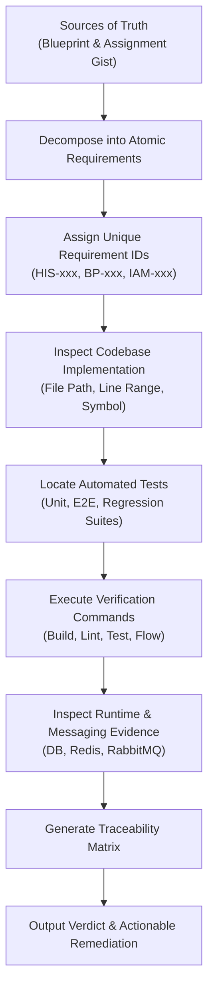

# HIS Compliance & Traceability Audit Skill

This skill performs a rigorous, evidence-based compliance audit of the `his-microservices-assignment` codebase against its two primary sources of truth:
1. **Enterprise Backend Blueprint**: [https://iots1.github.io/enterprise-backend-blueprint/](https://iots1.github.io/enterprise-backend-blueprint/)
2. **HIS Microservices Assignment Gist**: [https://gist.github.com/iots1/e5d1b5c19b39171a96b236af4a0a7f27](https://gist.github.com/iots1/e5d1b5c19b39171a96b236af4a0a7f27)

---

## 🛑 Cardinal Rules of Auditing

1. **Code & Test Evidence is King**: Never trust documentation alone. Claims in `README.md`, `.kiro/`, or `tasks.md` are supporting notes only. They **MUST NOT** be used as proof that an implementation exists.
2. **No Mock-Only Verification**: Tests that exclusively mock all internal modules without asserting real integration/runtime logic are graded as `PARTIAL`.
3. **Fresh Execution Required**: Verification must run live automated checks (`npm run lint:check`, `npm run build`, `npm test`, `npm run test:e2e`, `npm run test:flow`) and inspect runtime states.
4. **Binary & Unbiased Grading**: Every requirement must be classified into one of the 5 defined statuses without sugarcoating.

---

## 📊 Audit Execution Pipeline



---

## 🏷️ Requirement ID Taxonomy

Every requirement must belong to an ID namespace:

| Prefix | Domain | Source of Truth | Examples |
| :--- | :--- | :--- | :--- |
| **`HIS-xxx`** | HIS Assignment Core & Architecture | Assignment Gist | Service Ports, Event Flow, Outbox, DB Boundaries |
| **`BP-xxx`** | Enterprise Backend Blueprint Standards | Blueprint Guide | Naming Conventions, JSON:API Envelopes, Tracing |
| **`IAM-xxx`** | Security, Identity & Stateful Auth | Blueprint Auth Guide | JWT Rotation, Redis Session, Blacklist, RBAC |

---

## 🚦 Status Classification Criteria

| Status | Exact Condition |
| :--- | :--- |
| **`VERIFIED`** | ✅ Code implementation found + automated tests pass + runtime verification confirmed. |
| **`PARTIAL`** | ⚠️ Code exists but lacks unit/e2e tests, OR test mocks everything without asserting integration, OR requirement is partially satisfied. |
| **`MISSING`** | ❌ Requirement has no code implementation and no test coverage in the codebase. |
| **`INCORRECT`** | 🚨 README/docs claim feature is completed, but actual code is broken, missing, or contradicts requirements. |
| **`N/A`** | ⚪ Explicitly documented as out-of-scope or overridden by an approved architectural directive. |

---

## 📋 Comprehensive Requirement Catalog

### 1. HIS Assignment Core (`HIS-xxx`)

- **`HIS-001`**: `opd-bc` listens on Port `3000` (`apps/opd-bc/src/main.ts`).
- **`HIS-002`**: `emr-bc` listens on Port `3001` (`apps/emr-bc/src/main.ts`).
- **`HIS-003`**: `finance-bc` listens on Port `3002` (`apps/finance-bc/src/main.ts`).
- **`HIS-004`**: `iam-bc` listens on Port `3003` (`apps/iam-bc/src/main.ts`).
- **`HIS-005`**: Database per service pattern: `opd_db`, `emr_db`, `finance_db`, `iam_db` created via `docker/postgres/init.sql`.
- **`HIS-006`**: Zero cross-database joins across bounded contexts (foreign entities referenced strictly by UUID string).
- **`HIS-007`**: RabbitMQ Topic Exchange named `his.events` with durable exchange configuration.
- **`HIS-008`**: Service consumer queues (`opd.events`, `emr.events`, `finance.events`) configured as durable with proper routing keys.
- **`HIS-009`**: Event `visit.created` emitted by `opd-bc` on visit creation with payload `{ visitId, patientId, timestamp }`.
- **`HIS-010`**: `emr-bc` consumes `visit.created` and prepares initial medical record (status `WAITING`).
- **`HIS-011`**: Event `treatment.completed` emitted by `emr-bc` on treatment completion with payload `{ visitId, recordId, treatmentCost }`.
- **`HIS-012`**: `finance-bc` consumes `treatment.completed` and creates pending invoice with total amount matching treatment cost.
- **`HIS-013`**: Event `invoice.paid` emitted by `finance-bc` on payment with payload `{ visitId, invoiceId, status: "PAID" }`.
- **`HIS-014`**: `opd-bc` consumes `invoice.paid` and closes the visit (status updated to `CLOSED`).
- **`HIS-015`**: Transactional Outbox Pattern: Events saved to `outbox_events` within the same database transaction before publishing.
- **`HIS-016`**: Outbox Relay Worker: Background cron/polling relaying unpublished outbox events to RabbitMQ and marking them published.
- **`HIS-017`**: Idempotent Event Consumers: Message deduplication using `idempotent_consumers` table or event ID tracking.

### 2. Enterprise Backend Blueprint Standards (`BP-xxx`)

- **`BP-001`**: NestJS Module naming follows `Singular + Module` (e.g. `PatientModule`, `VisitModule`, `InvoiceModule`).
- **`BP-002`**: NestJS Controller naming follows `Plural + Controller` (e.g. `PatientsController`, `VisitsController`).
- **`BP-003`**: NestJS Service naming follows `Plural + Service` (e.g. `PatientsService`, `VisitsService`).
- **`BP-004`**: NestJS Event Controller naming follows `Singular + -events` (e.g. `VisitEventsController`, `InvoiceEventsController`).
- **`BP-005`**: Entity classes named `Singular, PascalCase` with `snake_case` properties mapping 1-to-1 with DB columns.
- **`BP-006`**: Boolean entity properties use question-like prefixes (`is_`, `has_`, `can_`, `should_`).
- **`BP-007`**: PostgreSQL naming: tables `plural, snake_case`, constraints `pk_<table>`, `fk_<table>_<ref>`, `idx_<table>_<cols>`, `uq_<table>_<cols>`, `chk_<table>_<cond>`.
- **`BP-008`**: Standard Response Envelope for Success: `{ status: { code: 200000 | 201000, message: "Request Succeeded" }, data: { id, type, attributes: { ... } }, meta: { timestamp } }`.
- **`BP-009`**: Standard Response Envelope for Errors: `{ status: { code, message }, errors: [{ code, title, detail, source? }], meta: { timestamp } }`.
- **`BP-010`**: Validation Error Envelope: Status code `400001`, message `"Validation Failed"`, detailing field violations.
- **`BP-011`**: Strict DTO validation with `ValidationPipe` (`whitelist: true`, `forbidNonWhitelisted: true`, `transform: true`).
- **`BP-012`**: Centralized exception filtering via `AllExceptionsFilter` logging structured JSON errors.
- **`BP-013`**: Distributed Tracing headers: `x-correlation-id`, `x-trace-id`, `x-span-id` extracted, propagated, and returned in response headers.
- **`BP-014`**: Structured JSON Logger across all microservices with standard fields (`timestamp`, `level`, `message`, `service`, `trace`, `context`).
- **`BP-015`**: OpenAPI / Swagger documentation enabled on all services under `/docs`.
- **`BP-016`**: Clean Architecture & Monorepo path aliases (`@app/common`, `@app/contracts`) avoiding fragile relative directory traversal.

### 3. IAM & Stateful Authentication (`IAM-xxx`)

- **`IAM-001`**: User registration (`POST /auth/register`) with Bcrypt password hashing (salt rounds $\ge$ 10) and role assignment.
- **`IAM-002`**: User login (`POST /auth/login`) issuing Stateful JWT token pair (`access_token` 15m TTL, `refresh_token` 7d TTL).
- **`IAM-003`**: Redis Session Store: Session stored at `auth:session:{userId}:{sessionId}` containing active `refreshTokenJti`.
- **`IAM-004`**: Refresh Token Rotation: `POST /auth/refresh` invalidates previous refresh token and issues a new pair.
- **`IAM-005`**: Token-Theft / Reuse Detection: Replaying an old refresh token immediately revokes all active sessions for that user.
- **`IAM-006`**: Stateful Logout (`POST /auth/logout`): Deletes Redis session and blacklists the current access token (`auth:blacklist:{jti}`).
- **`IAM-007`**: `JwtAuthGuard`: Intercepts protected routes, verifies signature, checks Redis session existence and token blacklist status.
- **`IAM-008`**: Fail-Closed Circuit Breaker: Returns `503 Service Unavailable` if Redis session store is unreachable during auth verification.
- **`IAM-009`**: `RolesGuard`: Role-Based Access Control enforcing `@Roles(...)` decorators with `ADMIN`, `DOCTOR`, `NURSE`, `FINANCE_STAFF`, `PATIENT`.
- **`IAM-010`**: Public Route Opt-out: `@Public()` decorator bypassing authentication on health checks and auth endpoints.

---

## 🔬 Audit Execution Procedure

When this skill is invoked, execute the following steps sequentially:

### Step 1: Run Static Quality & Test Verification
Run the complete automated test suite to gather real-time execution proof:
```bash
# 1. Check linting
npm run lint:check

# 2. Verify compilation
npm run build

# 3. Run all unit & integration tests
npm test

# 4. Run all E2E test suites
npm run test:e2e

# 5. Verify live event-driven choreography flow
npm run test:flow
```

### Step 2: Code Evidence Inspection
Search the codebase directly using `grep_search` and `view_file` to locate actual classes, decorators, configs, and constraints for each requirement ID.

### Step 3: Test Evidence Inspection
Inspect unit test specs (`*.spec.ts`) and E2E test specs (`*.e2e-spec.ts`, `test/e2e/*`) to verify that tests actually assert real business logic and not just empty mocks.

### Step 4: Generate Traceability Matrix
Construct the Traceability Matrix Markdown table:

```markdown
| ID | Requirement Description | Source | Code Evidence | Test Evidence | Runtime Evidence | Status |
| :--- | :--- | :--- | :--- | :--- | :--- | :---: |
| `HIS-001` | OPD port 3000 | Gist | `apps/opd-bc/src/main.ts:15` | `apps/opd-bc/test/unit/config.spec.ts` | Process listen 3000 | `VERIFIED` |
| `HIS-015` | Transactional Outbox | Gist | `libs/common/src/outbox/outbox.service.ts` | `test/unit/outbox.spec.ts` | DB outbox_events | `VERIFIED` |
| `BP-008` | JSON:API Response Envelope | Blueprint | `libs/common/src/interceptors/transform.interceptor.ts` | `test/unit/response.spec.ts` | HTTP 200000 envelope | `VERIFIED` |
| `IAM-005` | Refresh Token Theft Protection | Blueprint | `apps/iam-bc/src/modules/auth/services/auth.service.ts:260` | `apps/iam-bc/test/e2e/auth.e2e-spec.ts:145` | Redis session revocation | `VERIFIED` |
```

### Step 5: Summary & Scorecard Calculation
Calculate compliance statistics:
- **Total Requirements Audited**
- **Verified Count (%)**
- **Partial Count (%)**
- **Missing Count (%)**
- **Incorrect Count (%)**

---

## 🛠️ Actionable Remediation Protocol

For any item graded as `PARTIAL`, `MISSING`, or `INCORRECT`:
1. Provide the exact file path and line number where the defect exists.
2. Explain what is missing (e.g. missing test coverage, missing constraint, unhandled edge case).
3. Provide the exact code snippet / test case needed to achieve `VERIFIED` status.
