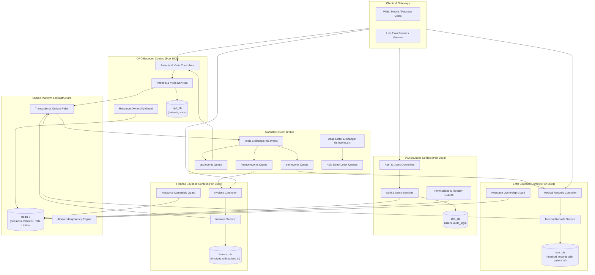
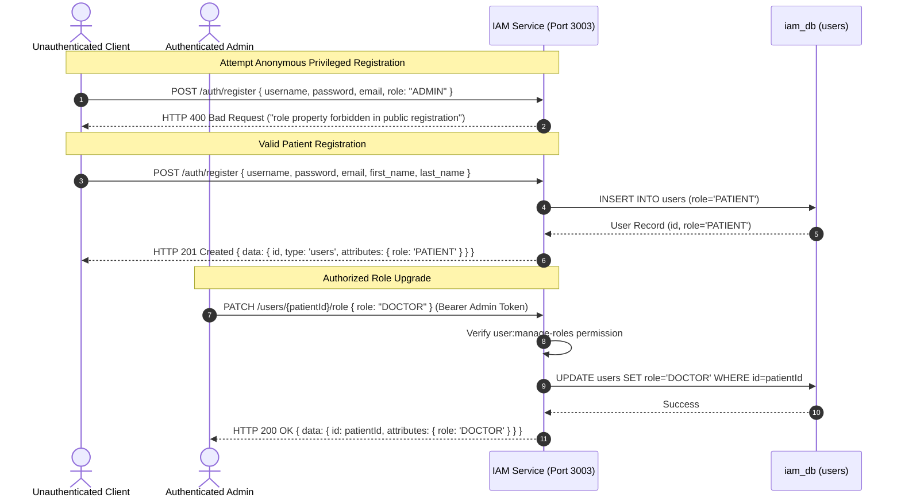
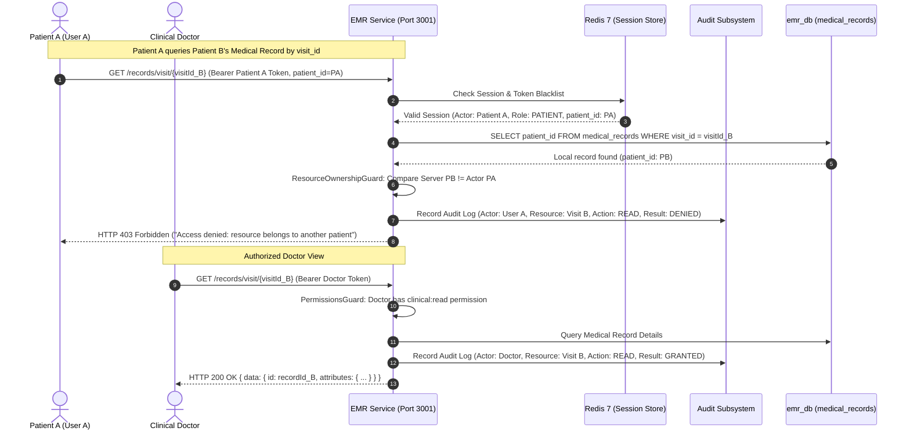
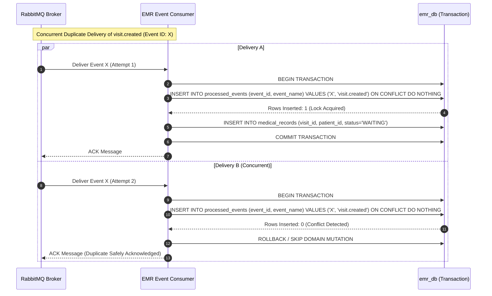
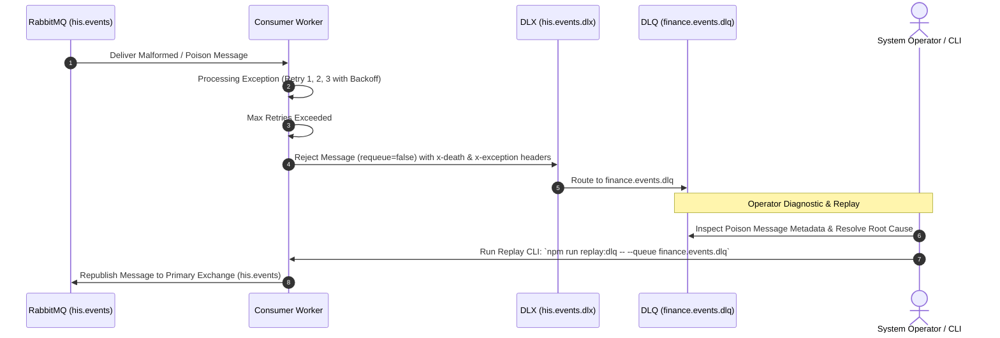
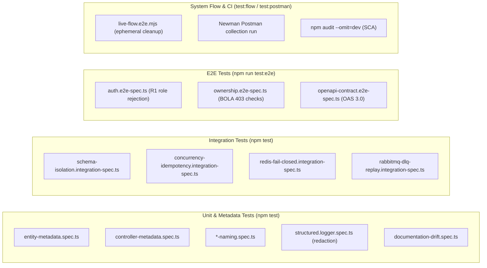
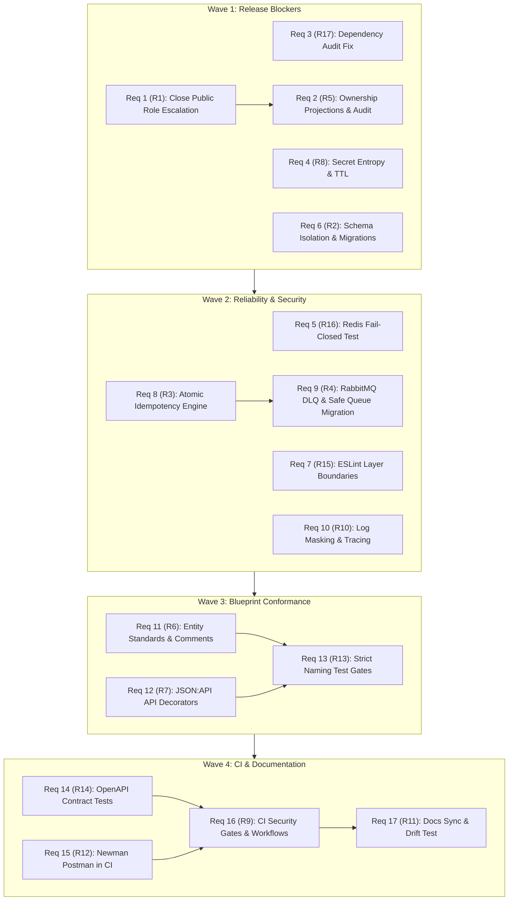

# Technical Design: Compliance Remediation

---

**Specification:** `compliance-remediation`  
**Status:** Approved Draft  
**Reference:** `docs/HIS_COMPLIANCE_AUDIT_2026-08-26.md`  
**Target Verdict:** READY (100% Verification across all 76 items, 0 High/Critical CVEs, 0 Broken Boundaries)

---

## 1. Overview

This technical design specifies the architectural, security, database, messaging, and validation changes required to resolve all 17 remediation areas (**R1–R17**) and 15 missing automated test domains for the Hospital Information System (HIS) Microservices monorepo.

The platform comprises four NestJS bounded context microservices (`opd-bc` on port 3000, `emr-bc` on port 3001, `finance-bc` on port 3002, `iam-bc` on port 3003) and shared libraries (`@app/common`, `@app/contracts`). This brownfield remediation preserves all existing, verified domain workflows (OPD visit registration → EMR treatment completion → Finance invoice payment → OPD visit closure) while hardening authentication, authorization (BOLA prevention), database schema isolation, asynchronous messaging resilience, error handling, logging, and CI validation gates.

### Goals
- **Eliminate Security Vulnerabilities**: Remove public role escalation (R1), prevent Broken Object Level Authorization (BOLA) via server-side patient ownership projections (R5), enforce fail-closed 32+ character secrets (R8), verify Redis fail-closed behavior (R16), and resolve the `js-yaml` CVE (R17).
- **Restore Architecture & Database Isolation**: Disable `synchronize: true`, enforce per-BC TypeORM migrations from empty databases, register explicit entity allowlists per connection (R2), and enforce ESLint layer boundaries (R15).
- **Guarantee Messaging Reliability**: Make event idempotency concurrency-safe using atomic database reservations (R3), establish RabbitMQ Dead-Letter Exchanges (`his.events.dlx`) and Queues with immutable-queue migration runbooks, retry backoff, and operator replay (R4), and propagate distributed trace headers across event hops (R10).
- **Achieve Enterprise Blueprint & CI Conformance**: Standardize entity metadata, comments, and `timestamptz` types (R6), apply JSON:API response decorators and `@RequirePermission` (R7), enforce strict naming (R13), automate OpenAPI E2E validation (R14), run Newman Postman tests in CI (R12), harden CI workflows with SAST and SCA (R9), and prevent documentation drift (R11).

### Non-Goals
- Modifying the core choreographic business workflow (`visit.created` → `treatment.completed` → `invoice.paid` → `CLOSED`).
- Introducing cross-database SQL queries or distributed two-phase commit transactions.
- Replacing PostgreSQL 16, RabbitMQ 3, or Redis 7 with alternative infrastructure engines.
- Introducing breaking changes to existing REST API endpoints or RabbitMQ routing key names.

---

## 2. Boundary Commitments

### This Spec Owns
- **Security & IAM**: Public registration payload validation (`RegisterUserDTO`), administrative role assignment (`PATCH /users/:id/role`), resource ownership policy enforcement (`@RequirePermission`, `ResourceOwnershipGuard`), trusted event-derived local patient ownership projections, durable PHI/billing access audit logging, and Redis rate limiting.
- **Database & Persistence**: Per-BC database schema migrations, TypeORM explicit entity allowlists, disabling runtime synchronization (`synchronize: false`), and schema allowlist validation tests.
- **Messaging & Observability**: Concurrency-safe `IdempotencyService` atomic event reservation, RabbitMQ DLX/DLQ topology, safe immutable queue migration procedures, exponential retry backoff, operator replay CLI, structured log sensitive field masking, and distributed trace header forwarding.
- **Blueprint & CI Conformance**: Entity metadata comments and constraints, JSON:API response decorators, automated OpenAPI schema validation, Newman Postman CI integration, CI security scanners, and documentation drift checks.

### Out of Boundary
- Core domain model alterations to `Patient`, `Visit`, `MedicalRecord`, or `Invoice` business logic.
- Replacement of NestJS framework, TypeORM, or core architectural libraries.
- Modification of non-HIS services or external third-party repositories.

### Allowed Dependencies
- **Inward Dependency Direction**: `Entities/Contracts` → `Services/Use Cases` → `Controllers/Adapters` → `NestJS Modules/Bootstrap`.
- **Monorepo Aliases**: `@app/common`, `@app/contracts`, `@apps/opd-bc/*`, `@apps/emr-bc/*`, `@apps/finance-bc/*`, `@apps/iam-bc/*`.
- **External Dependencies**: NestJS 11, TypeORM 1.1+, PostgreSQL driver (`pg`), `amqplib`, `ioredis`, `class-validator`, `class-transformer`, `@nestjs/swagger`, `newman`.

### Revalidation Triggers
- Modification of JWT token payload structure (must revalidate `JwtAuthGuard`, `ResourceOwnershipGuard`, and Postman tests).
- Entity definition changes or database migration alterations (must revalidate schema allowlist tests and migration-from-empty tests).
- RabbitMQ exchange/queue parameter updates (must revalidate live-flow test and DLQ integration tests).
- Controller route decorator changes (must revalidate OpenAPI contract tests and documentation drift tests).

---

## 3. Architecture

### Architecture Pattern & Boundary Map

The system adheres to a **Domain-Driven Design (DDD) Hexagonal / Clean Architecture** within a monorepo structure. Each bounded context application is completely self-contained, owning its logical database schema and communicating exclusively via asynchronous RabbitMQ domain events or authenticated HTTP APIs.



### Technology Stack & Dependency Decisions

| Layer | Component / Library | Version | Role in Remediation | Notes |
|---|---|---|---|---|
| **Runtime & Framework** | Node.js / NestJS | 22 LTS / 11.0.1 | Application runtime & microservices container | Strict TypeScript mode |
| **API Documentation** | `@nestjs/swagger` | `^11.4.7` (patched) | OpenAPI 3.0 document generation at `/docs` | Resolves GHSA-pm4m-ph32-ghv5 (`js-yaml`) |
| **Database & ORM** | PostgreSQL / TypeORM | 16 Alpine / 1.1.0 | Persistence with strict migrations & schema isolation | `synchronize: false` enforced |
| **Message Broker** | RabbitMQ / `amqplib` | 3 Management / 2.0.1 | Topic exchange choreography with DLX/DLQ support | Durable queues, prefetch=1 |
| **Cache & Session** | Redis / `ioredis` | 7 Alpine / 5.11.1 | Session storage, token blacklisting, and rate limiting | Verified fail-closed integration |
| **Validation & Auth** | `class-validator` / `@nestjs/jwt` | 0.15.1 / 11.0.2 | DTO whitelist validation & JWT token verification | 32+ char secret entropy required |
| **Testing & CI** | Jest / Newman / GitHub Actions | 30.0.0 / 6.2.1 | Automated unit, integration, E2E, and CI security gates | SAST & SCA checks |

---

## 4. File Structure Plan

```text
his-project/
├── apps/
│   ├── iam-bc/
│   │   ├── src/
│   │   │   ├── modules/
│   │   │   │   ├── auth/
│   │   │   │   │   ├── controllers/auth.controller.ts        # [MODIFY] Role-free register, refresh, logout
│   │   │   │   │   ├── dto/register-user.dto.ts              # [MODIFY] Remove role property
│   │   │   │   │   └── services/auth.service.ts              # [MODIFY] Fail-closed secrets, dynamic TTL
│   │   │   │   └── user/
│   │   │   │       ├── controllers/users.controller.ts       # [NEW] Administrative PATCH /users/:id/role
│   │   │   │       ├── dto/update-user-role.dto.ts           # [NEW] DTO validating UserRole
│   │   │   │       ├── entities/user.entity.ts               # [MODIFY] Database key, comments, timestamptz
│   │   │   │       └── services/users.service.ts             # [MODIFY] Role update method with authorization
│   │   │   └── iam-bc.module.ts                              # [MODIFY] Explicit entity list, migrations
│   │   └── test/
│   │       ├── e2e/auth.e2e-spec.ts                          # [MODIFY] Test role escalation rejection
│   │       └── unit/users.controller.spec.ts                 # [NEW] Test role update permissions
│   ├── opd-bc/
│   │   ├── src/
│   │   │   ├── modules/
│   │   │   │   ├── patient/
│   │   │   │   │   ├── controllers/patients.controller.ts    # [MODIFY] Ownership guard & JSON:API decorators
│   │   │   │   │   └── entities/patient.entity.ts            # [MODIFY] Database key, comments, timestamptz
│   │   │   │   └── visit/
│   │   │   │       ├── controllers/visits.controller.ts      # [MODIFY] Ownership guard & JSON:API decorators
│   │   │   │       └── entities/visit.entity.ts              # [MODIFY] Database key, comments, timestamptz
│   │   │   └── opd-bc.module.ts                              # [MODIFY] Explicit entity list, migrations
│   │   └── test/
│   │       └── e2e/ownership.e2e-spec.ts                     # [NEW] BOLA cross-patient denial tests
│   ├── emr-bc/
│   │   ├── src/
│   │   │   ├── modules/medical-record/
│   │   │   │   ├── controllers/medical-records.controller.ts # [MODIFY] Ownership guard & JSON:API decorators
│   │   │   │   ├── controllers/medical-record-events.controller.ts # [MODIFY] Store patient_id from visit.created
│   │   │   │   └── entities/medical-record.entity.ts         # [MODIFY] Add patient_id column, comments, timestamptz
│   │   │   └── emr-bc.module.ts                              # [MODIFY] Explicit entity list, migrations
│   │   └── test/
│   │       └── e2e/ownership.e2e-spec.ts                     # [NEW] BOLA clinical record denial tests
│   └── finance-bc/
│       ├── src/
│       │   ├── modules/invoice/
│       │   │   ├── controllers/invoices.controller.ts        # [MODIFY] Ownership guard & JSON:API decorators
│       │   │   ├── controllers/invoice-events.controller.ts  # [MODIFY] Store patient_id from treatment.completed
│       │   │   └── entities/invoice.entity.ts                # [MODIFY] Add patient_id column, comments, timestamptz
│       │   └── finance-bc.module.ts                          # [MODIFY] Explicit entity list, migrations
│       └── test/
│           └── e2e/ownership.e2e-spec.ts                     # [NEW] BOLA invoice denial tests
├── libs/
│   ├── common/
│   │   ├── src/
│   │   │   ├── audit/                                        # [NEW] Durable PHI/billing access audit module
│   │   │   │   ├── audit.module.ts
│   │   │   │   ├── audit.service.ts
│   │   │   │   └── entities/audit-log.entity.ts
│   │   │   ├── auth/
│   │   │   │   ├── auth-common.module.ts                     # [MODIFY] Fail-closed secret getOrThrow
│   │   │   │   ├── decorators/require-permission.decorator.ts# [NEW] Granular permission decorator
│   │   │   │   ├── guards/jwt-auth.guard.ts                  # [MODIFY] Fail-closed Redis error handling
│   │   │   │   ├── guards/permissions.guard.ts               # [NEW] Permission check guard
│   │   │   │   └── guards/resource-ownership.guard.ts        # [NEW] Server-side trusted BOLA ownership guard
│   │   │   ├── config/environment.config.ts                  # [MODIFY] Synchronize: false, secret entropy check
│   │   │   ├── idempotency/
│   │   │   │   ├── idempotency.service.ts                    # [MODIFY] Atomic INSERT ON CONFLICT DO NOTHING
│   │   │   │   └── processed-event.entity.ts                 # [MODIFY] Database key, comments, timestamptz
│   │   │   ├── logging/structured.logger.ts                  # [MODIFY] Sensitive field redaction
│   │   │   ├── migrations/                                   # [NEW] Dedicated per-BC migration files
│   │   │   │   ├── opd/1000000000000-init-opd.ts
│   │   │   │   ├── emr/1000000000000-init-emr.ts
│   │   │   │   ├── finance/1000000000000-init-finance.ts
│   │   │   │   └── iam/1000000000000-init-iam.ts
│   │   │   ├── outbox/outbox-event.entity.ts                 # [MODIFY] Database key, comments, timestamptz
│   │   │   ├── response/decorators/                          # [NEW] Standardized JSON:API Swagger decorators
│   │   │   │   ├── api-success-response.decorator.ts
│   │   │   │   └── api-error-response.decorator.ts
│   │   │   ├── rmq/
│   │   │   │   ├── rabbitmq-options.service.ts               # [MODIFY] DLX/DLQ topology configuration
│   │   │   │   ├── rabbitmq-replay.service.ts                # [NEW] Operator DLQ message replay utility
│   │   │   │   └── trace-propagation.interceptor.ts          # [NEW] Forward trace headers into RMQ
│   │   │   └── throttler/rate-limit.guard.ts                 # [NEW] Redis-backed rate limiting guard
│   │   └── test/
│   │       ├── audit.service.spec.ts                         # [NEW] Unit tests for audit logging
│   │       └── resource-ownership.guard.spec.ts              # [NEW] Unit tests for ownership checks
│   └── contracts/
│       ├── src/events/treatment-completed.event.ts           # [MODIFY] Add optional patientId to payload
│       └── src/rabbitmq.constants.ts                         # [MODIFY] DLX and DLQ routing constants
├── test/
│   ├── e2e/
│   │   ├── live-flow.e2e.mjs                                 # [MODIFY] Dynamic admin bootstrap & session cleanup
│   │   └── openapi-contract.e2e-spec.ts                      # [NEW] Automated OpenAPI 3.0 schema test
│   ├── integration/
│   │   ├── concurrency-idempotency.integration-spec.ts       # [NEW] 20 parallel duplicate events test
│   │   ├── rabbitmq-dlq-replay.integration-spec.ts           # [NEW] DLQ quarantine & replay test
│   │   ├── redis-fail-closed.integration-spec.ts             # [NEW] Redis outage fail-closed test
│   │   └── schema-isolation.integration-spec.ts              # [NEW] DB table allowlist assertion test
│   └── unit/
│       ├── architecture-boundaries.spec.ts                   # [NEW] Cross-BC import boundary test
│       ├── controller-metadata.spec.ts                       # [NEW] Decorator conformance test
│       ├── documentation-drift.spec.ts                       # [NEW] README RBAC drift test
│       └── entity-metadata.spec.ts                           # [NEW] Entity database & comment test
├── .github/workflows/ci.yml                                  # [MODIFY] SCA, SAST, schema checks, Newman
├── docs/postman/his.postman_collection.json                  # [MODIFY] Clean authenticated test fixture
└── eslint.config.mjs                                         # [MODIFY] Dependency boundary lint rules
```

---

## 5. System Flows

### Flow 1: Secure Registration & Privileged Role Provisioning (R1)



### Flow 2: Server-Side Patient Ownership Resolution & Access Audit (R5)



### Flow 3: Concurrency-Safe Idempotent Event Consumption (R3, R8)



### Flow 4: Dead-Letter Queue Quarantine & Operator Replay (R4, R9)



---

## 6. Requirements Traceability Matrix

| Requirement ID | Summary | Architectural Components | Primary Interfaces & Decorators | System Flows |
|---|---|---|---|---|
| **1.1 – 1.4** | Role Escalation Prevention & Privileged Role Update | `AuthService`, `UsersController`, `RegisterUserDTO`, `UpdateUserRoleDTO` | `POST /auth/register`, `PATCH /users/:id/role`, `@RequirePermission('user:manage-roles')` | Flow 1 |
| **2.1 – 2.5** | Resource Ownership (BOLA), Durable Audit & Rate Limiting | `ResourceOwnershipGuard`, `PermissionsGuard`, `AuditService`, `RateLimitGuard` | `@RequirePermission(...)`, `@UseGuards(ResourceOwnershipGuard)`, `audit_logs` table | Flow 2 |
| **3.1 – 3.3** | Production Dependency CVE Remediation (`js-yaml`) | `package.json`, `@nestjs/swagger` resolution | `npm audit --omit=dev --audit-level=low` | CI / Build |
| **4.1 – 4.3** | Fail-Closed Secrets, Dynamic TTL & Ephemeral Cleanup | `AuthCommonModule`, `ConfigService`, `live-flow.e2e.mjs` | `ConfigService.getOrThrow`, `JWT_ACCESS_EXPIRES_IN`, `JWT_REFRESH_EXPIRES_IN` | Bootstrap / Test |
| **5.1 – 5.3** | Real Redis Lifecycle & Fail-Closed Guard | `JwtAuthGuard`, `RedisService` | `RedisService.isHealthy()`, HTTP 401/503 Fail-Closed Handler | Auth Guard |
| **6.1 – 6.4** | Deterministic Schema Isolation & Per-BC Migrations | `createPostgresOptions`, TypeORM Migrations (`opd`, `emr`, `finance`, `iam`) | `synchronize: false`, explicit `entities: [...]`, schema allowlist validator | Migration Flow |
| **7.1 – 7.3** | Clean-Architecture Layer Seams & Boundary Linter | `eslint.config.mjs`, TypeScript Path Aliases | ESLint import boundary rules, `@app/contracts` | Linter / CI |
| **8.1 – 8.4** | Concurrency-Safe Deduplication & Crash Outbox | `IdempotencyService`, `OutboxEventsService`, `OutboxRelay` | `INSERT ... ON CONFLICT DO NOTHING`, `published_at` transaction | Flow 3 |
| **9.1 – 9.4** | RabbitMQ DLX/DLQ, Retry Backoff & Operator Replay | `RabbitMqOptionsService`, `RabbitMqReplayService` | `his.events.dlx`, `*.dlq`, exponential backoff interceptor | Flow 4 |
| **10.1 – 10.4** | Typed Exceptions, Structured Log Redaction & Trace | `StructuredLogger`, `AllExceptionsFilter`, `TraceInterceptor` | `[REDACTED]` masking, `x-correlation-id`, `x-trace-id` propagation | Observability |
| **11.1 – 11.3** | Entity Database Keys, Comments & Timestamptz | All `@Entity` classes | `database: 'opd_db'`, `comment: '...'`, `type: 'timestamptz'` | Data Layer |
| **12.1 – 12.3** | Standardized JSON:API Swagger & Permission Decorators | All HTTP Controllers | `@ApiSuccessResponse`, `@ApiErrorResponse`, `@HttpCode`, `@ApiOperation` | API Layer |
| **13.1 – 13.3** | Strict Naming Convention Alignment & Metadata Gates | Architecture Naming Test Suites | `*-naming.spec.ts`, constraint prefixes (`pk_`, `fk_`, `uq_`, `idx_`, `chk_`) | Test Suite |
| **14.1 – 14.3** | Automated OpenAPI Contract Conformance Tests | `openapi-contract.e2e-spec.ts` | `/docs-json` schema validation, Bearer security scheme assertion | E2E Tests |
| **15.1 – 15.3** | Automated Newman Postman E2E Test Suite in CI | `his.postman_collection.json`, `npm run test:postman` | Newman runner executing complete outpatient journey | CI Workflow |
| **16.1 – 16.3** | CI Security Scanning, SAST & Verification Gates | `.github/workflows/ci.yml` | `npm audit`, schema allowlist, migration-from-empty, Newman gates | CI Pipeline |
| **17.1 – 17.3** | Documentation Synchronization & Drift Prevention | `README.md`, `documentation-drift.spec.ts` | RBAC metadata scanner asserting README matrix equality | Documentation |

---

## 7. Components and Interfaces

### Component Summary Table

| Component | Domain / Layer | Intent | Req Coverage | Key Dependencies | Contracts |
|---|---|---|---|---|---|
| **`AuthSecurityModule`** | IAM / Security | Secure registration, role assignment & fail-closed secrets | 1.1–1.4, 4.1–4.3 | `UsersService`, `JwtService`, `RedisService` | API, Service |
| **`ResourceOwnershipGuard`** | Platform / Security | Prevent BOLA by verifying patient actor owns requested resource | 2.1–2.3 | `Reflector`, `RedisService`, DB Repositories | Service |
| **`AuditService`** | Platform / Security | Durable PHI and billing access audit logging | 2.4 | `AuditLogRepository`, TypeORM | Service, State |
| **`RateLimitGuard`** | Platform / Security | Redis-backed IP/user throttling for auth and sensitive APIs | 2.5 | `RedisService`, `Reflector` | Service |
| **`DatabaseIsolationEngine`** | Platform / Persistence | Strict per-BC migrations and entity isolation (`synchronize: false`) | 6.1–6.4, 11.1–11.3 | PostgreSQL, TypeORM | State, Batch |
| **`AtomicIdempotencyEngine`** | Platform / Messaging | Race-free duplicate event deduplication via DB locks | 8.1–8.4 | TypeORM `DataSource`, `ProcessedEvent` | Service, State |
| **`RabbitMqResilienceEngine`**| Platform / Messaging | DLX/DLQ topology, safe queue migrations, and operator replay | 9.1–9.4 | `amqplib`, NestJS RMQ Transport | Event, Batch |
| **`StructuredLogRedactor`** | Platform / Observability| Mask sensitive fields in logs and propagate distributed traces | 10.1–10.4 | `StructuredLogger`, Express Middleware | Service |
| **`BlueprintDecoratorEngine`**| Platform / API | JSON:API response formatting and OpenAPI metadata compliance | 12.1–12.3, 14.1–14.3 | `@nestjs/swagger`, `TransformInterceptor` | API |
| **`CiVerificationPipeline`** | CI / Delivery | Automated SAST, SCA, Newman, and schema isolation gates | 3.2, 15.1–16.3 | GitHub Actions, Docker, Newman | Batch |

---

### Detailed Component Specifications

#### 1. `ResourceOwnershipGuard` & Server-Side Patient Ownership Projections
- **Location**: `libs/common/src/auth/guards/resource-ownership.guard.ts`
- **Intent**: Deterministic server-side authorization ensuring patients can only access their own resources across OPD, EMR, and Finance without cross-database joins and without trusting client request parameters.

##### Source of Truth & Local Projections Architecture
1. **Source of Truth**: OPD (`opd_db.patients` and `opd_db.visits`) is the authoritative aggregate root for Patient identity and Visit creation.
2. **Event & Data Propagation**:
   - OPD publishes `visit.created` (`{ visitId: string, patientId: string, timestamp: string }`).
   - `emr-bc` consumes `visit.created` and persists a local `patient_id` column in `medical_records` (in `emr_db`).
   - `emr-bc` publishes `treatment.completed` (`{ visitId: string, recordId: string, treatmentCost: number, patientId?: string }`).
   - `finance-bc` consumes `treatment.completed` (or subscribes to `visit.created`) and persists a local `patient_id` column in `invoices` (in `finance_db`).
3. **Consistency Behavior**:
   - `visit.created` and `treatment.completed` events are written to the transactional outbox table within the same database transaction as the aggregate mutation.
   - Eventual consistency is achieved sub-second across services via RabbitMQ durable topic routing.
4. **Authorization Failure Behavior**:
   - When an authenticated user with `UserRole.PATIENT` submits a request to:
     - `GET /patients/:id` or `GET /visits/:id` (OPD)
     - `GET /records/:id` or `GET /records/visit/:visitId` (EMR)
     - `GET /invoices/:id` or `GET /invoices/visit/:visitId` (Finance)
   - The `ResourceOwnershipGuard`:
     1. Extracts `actor.patient_id` from the verified server-signed JWT (set during login/registration).
     2. Queries the local service repository (`PatientRepository`, `VisitRepository`, `MedicalRecordRepository`, or `InvoiceRepository`) in that service's local database.
     3. Compares the entity's server-stored `patient_id` with `actor.patient_id`.
     4. If the entity does not exist, throws `NotFoundException` (HTTP 404) immediately, leaking no unauthorized existence metadata.
     5. If `entity.patient_id !== actor.patient_id`, throws `ForbiddenException('Access denied: resource belongs to another patient')` (HTTP 403) and writes a durable `audit_logs` entry.
     6. Client-provided request body or header ownership assertions are strictly ignored.
5. **Stale / Missing Projection Behavior**:
   - If a patient queries an EMR or Finance record immediately after visit opening before the event consumer has processed `visit.created`, the local database returns null.
   - The guard/controller returns `NotFoundException` (HTTP 404) rather than granting unauthorized access or throwing unhandled errors.
6. **Impact on Event Contracts**:
   - `VisitCreatedEvent` already carries `patientId` in its payload. No breaking change.
   - `TreatmentCompletedEvent` contract adds an optional `patientId?: string` field to guarantee deterministic audit traceability in Finance, maintaining 100% backward compatibility.

---

#### 2. `AtomicIdempotencyEngine`
- **Location**: `libs/common/src/idempotency/idempotency.service.ts`
- **Intent**: Atomically reserve event IDs inside database transactions before executing domain business mutations to prevent duplicate processing under concurrent delivery.
- **Interface Contract**:
```typescript
@Injectable()
export class IdempotencyService {
  constructor(private readonly dataSource: DataSource) {}

  async process<T>(
    eventId: string,
    eventName: string,
    businessLogic: (manager: EntityManager) => Promise<T>,
  ): Promise<IdempotencyResult<T>> {
    return this.dataSource.transaction(async (manager) => {
      // Atomic reservation via raw SQL / TypeORM insert with ON CONFLICT DO NOTHING
      const insertResult = await manager
        .createQueryBuilder()
        .insert()
        .into(ProcessedEvent)
        .values({ event_id: eventId, event_name: eventName })
        .orIgnore()
        .execute();

      if (insertResult.raw.length === 0 && insertResult.identifiers.length === 0) {
        return { isDuplicate: true };
      }

      const value = await businessLogic(manager);
      return { isDuplicate: false, value };
    });
  }
}
```

---

#### 3. `RabbitMqResilienceEngine` & Queue Migration Strategy
- **Location**: `libs/common/src/rmq/rabbitmq-options.service.ts`
- **Intent**: Declare Dead-Letter Exchanges (`his.events.dlx`) and Dead-Letter Queues (`*.dlq`), with bounded exponential retry backoff, operator replay CLI, and safe multi-environment queue migration handling queue argument immutability.

##### Immutable Queue Migration Strategy
RabbitMQ queue arguments (e.g. `x-dead-letter-exchange`, `x-dead-letter-routing-key`) cannot be altered on existing queues without a `406 PRECONDITION_FAILED` error.

1. **Clean Test & Local Development Environment Behavior**:
   - For ephemeral test runners, unit/integration test suites, and fresh Docker environments:
     - Integration test harness / development scripts check queue declarations; if argument mismatches exist, the dev harness deletes and recreates the queues cleanly.
     - `npm run docker:clean` (`docker compose down -v`) provides a fresh broker topology.
2. **Production Migration & Runbook Behavior (Zero Message Loss)**:
   - Automated Blue-Green Queue Versioning:
     - **Phase 1 (Topology Setup)**: Assert Dead-Letter Exchange `his.events.dlx` and Dead-Letter Queues (`opd.events.dlq`, `emr.events.dlq`, `finance.events.dlq`).
     - **Phase 2 (Versioned Queue Declaration)**: Declare resilient versioned queues (e.g. `opd.events.v2`, `emr.events.v2`, `finance.events.v2`) configured with `x-dead-letter-exchange: his.events.dlx` and `x-dead-letter-routing-key: <service>.events.dlq`.
     - **Phase 3 (Parallel Binding)**: Bind `.v2` queues to `his.events` with their respective routing keys.
     - **Phase 4 (Service Deployment)**: Deploy updated service instances configured to consume from the `.v2` queues.
     - **Phase 5 (Drain In-Flight Messages)**: Shovel any lingering messages from the old unversioned queues to the `.v2` queues via `rabbitmqadmin shovel` or drain consumer.
     - **Phase 6 (Safe Decommission)**: Check old queue depth via RabbitMQ Management API (`messages_ready === 0 && messages_unacknowledged === 0`); only once empty, delete old unversioned queues.
3. **Rollback Behavior**:
   - If issues arise with `.v2` queues during deployment, service configuration can immediately revert to the original queues without data loss.
   - Any poisoned messages collected in the DLQ remain safely quarantined with original payload and headers for inspection and replay.
4. **Operator Replay Tooling**:
   - CLI script `npm run replay:dlq -- --queue <queue_name>` reads quarantined messages from the specified DLQ and republishes them to `his.events` for reprocessing.

---

## 8. Data Models & Logical Database Isolation

### Per-BC Database Table Allowlists

| Database | Allowed Tables | Schema Migration File |
|---|---|---|
| **`opd_db`** | `patients`, `visits`, `outbox_events`, `processed_events`, `migrations` | `libs/common/src/migrations/opd/1000000000000-init-opd.ts` |
| **`emr_db`** | `medical_records`, `outbox_events`, `processed_events`, `migrations` | `libs/common/src/migrations/emr/1000000000000-init-emr.ts` |
| **`finance_db`** | `invoices`, `outbox_events`, `processed_events`, `migrations` | `libs/common/src/migrations/finance/1000000000000-init-finance.ts` |
| **`iam_db`** | `users`, `audit_logs`, `outbox_events`, `processed_events`, `migrations` | `libs/common/src/migrations/iam/1000000000000-init-iam.ts` |

### Audit Log Entity Schema (`iam_db`)
```sql
CREATE TABLE audit_logs (
    id UUID PRIMARY KEY DEFAULT gen_random_uuid(),
    actor_id VARCHAR(100) NOT NULL,
    actor_role VARCHAR(50) NOT NULL,
    action VARCHAR(50) NOT NULL,
    resource_type VARCHAR(50) NOT NULL,
    resource_id VARCHAR(100) NOT NULL,
    ip_address VARCHAR(45),
    outcome VARCHAR(20) NOT NULL,
    metadata JSONB DEFAULT '{}',
    created_at TIMESTAMPTZ NOT NULL DEFAULT CURRENT_TIMESTAMP,
    CONSTRAINT pk_audit_logs PRIMARY KEY (id)
);
CREATE INDEX idx_audit_logs_actor_id ON audit_logs(actor_id);
CREATE INDEX idx_audit_logs_resource ON audit_logs(resource_type, resource_id);
```

---

## 9. Error Handling & Observability

### Standardized Error Responses
All exceptions caught by `AllExceptionsFilter` format responses according to the JSON:API error specification:
```json
{
  "errors": [
    {
      "status": "403",
      "code": "FORBIDDEN",
      "title": "Access Denied",
      "detail": "Access denied: resource does not belong to actor",
      "meta": {
        "correlation_id": "c7a8b9e0-1234-5678-9abc-def012345678",
        "timestamp": "2026-08-26T13:56:23.000Z"
      }
    }
  ]
}
```

### Sensitive Field Log Redaction
The `StructuredLogger` intercepts all log contexts and replaces values of sensitive keys (`password`, `access_token`, `refresh_token`, `authorization`, `id_card`, `email`, `jti`) with `[REDACTED]`:
```typescript
const SENSITIVE_KEYS = new Set([
  'password', 'token', 'access_token', 'refresh_token',
  'authorization', 'id_card', 'email', 'username', 'jti', 'secret'
]);
```

---

## 10. Testing Strategy

### Test Suites by Domain



---

## 11. Implementation Wave Plan & Rollout Strategy


