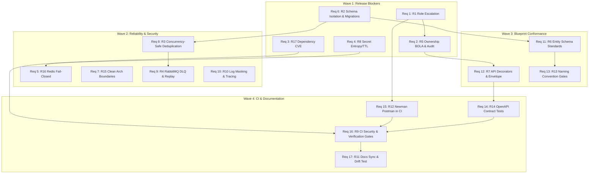

# Brownfield Implementation Gap Analysis: Compliance Remediation

**Specification:** `compliance-remediation`  
**Date:** 2026-08-26  
**Primary Reference:** `docs/HIS_COMPLIANCE_AUDIT_2026-08-26.md`  
**Current Audit Status:** NOT READY (63.2% Verified, 48 Verified / 17 Partial / 7 Missing / 4 Incorrect)  
**Target Status:** READY (100% Verified, Zero Critical/High Vulnerabilities, Zero Broken Boundaries)

---

## 1. Executive Summary

This gap analysis inspects the existing NestJS monorepo codebase in `his-project/` against all 17 remediation requirements (`R1`–`R17`) and 15 missing automated test domains. The codebase currently has a functional happy path (service bootstrap, basic OpenAPI, RabbitMQ topic exchange, transactional outbox persistence, baseline E2E flow), but exhibits critical gaps in authorization boundaries (anonymous privileged role registration, missing BOLA ownership policies), database schema isolation (`synchronize: true` contaminating all databases), production dependencies (`js-yaml` CVE), fail-open secrets, and messaging edge cases (concurrent deduplication races, lack of DLQ/replay).

### Classification Summary

| Classification | Count | Requirements |
|---|---|---|
| **EXISTING_BUT_INCORRECT** | 5 | Req 1 (R1), Req 3 (R17), Req 4 (R8), Req 6 (R2), Req 8 (R3) |
| **PARTIAL** | 9 | Req 2 (R5), Req 5 (R16), Req 7 (R15), Req 10 (R10), Req 11 (R6), Req 12 (R7), Req 13 (R13), Req 15 (R12), Req 16 (R9) |
| **MISSING** | 1 | Req 9 (R4) |
| **TEST_ONLY_GAP** | 1 | Req 14 (R14) |
| **DOC_ONLY_GAP** | 1 | Req 17 (R11) |
| **INFRA_ONLY_GAP** | 0 | — |
| **Total** | **17** | **Req 1 – Req 17** |

---

## 2. Requirement-by-Requirement Gap Analysis

---

### Requirement 1: Public Role Escalation Prevention & Privileged Role Provisioning
- **Audit Finding ID**: `R1` (SEC-001)
- **Severity**: CRITICAL
- **Classification**: `EXISTING_BUT_INCORRECT`
- **What Already Exists**:
  - `his-project/apps/iam-bc/src/modules/auth/dto/register-user.dto.ts` with registration validation.
  - `his-project/apps/iam-bc/src/modules/auth/controllers/auth.controller.ts` (`POST /auth/register`).
  - `his-project/apps/iam-bc/src/modules/auth/services/auth.service.ts` (`register` method).
  - `his-project/apps/iam-bc/src/modules/user/entities/user.entity.ts` (`role` column defaults to `PATIENT`).
- **What Is Partially Implemented**: `UserRole` enum exists in `@app/common`, and users are saved with roles in PostgreSQL `users` table.
- **What Is Missing**:
  - Dedicated administrative endpoint `PATCH /users/:id/role` for role modification.
  - Dedicated DTO `UpdateUserRoleDTO` validating `role: UserRole`.
  - `@RequirePermission('user:manage-roles')` or `@Roles(UserRole.ADMIN)` guard protection on the role update endpoint.
- **What Is Incorrect**: `RegisterUserDTO` declares optional `role?: UserRole`, allowing anonymous clients to register directly as `ADMIN` or `DOCTOR`.
- **What Must Be Preserved**: Valid anonymous patient registration without `role` returns HTTP 201 with user attributes in JSON:API envelope.
- **Exact Affected Files/Modules**:
  - `his-project/apps/iam-bc/src/modules/auth/dto/register-user.dto.ts`
  - `his-project/apps/iam-bc/src/modules/auth/controllers/auth.controller.ts`
  - `his-project/apps/iam-bc/src/modules/auth/services/auth.service.ts`
  - `his-project/apps/iam-bc/src/modules/user/controllers/users.controller.ts`
  - `his-project/apps/iam-bc/src/modules/user/dto/update-user-role.dto.ts`
  - `his-project/apps/iam-bc/src/modules/user/services/users.service.ts`
  - `his-project/apps/iam-bc/test/unit/register-user.dto.spec.ts`
  - `his-project/apps/iam-bc/test/e2e/auth.e2e-spec.ts`
- **Migration / Data Risks**: Low. Existing database rows are intact; only incoming registration behavior and role modification paths are affected.
- **Test Gaps**: Test Domain 1 (Registration rejecting `role: 'ADMIN'` with 400; registration defaulting to `PATIENT`; admin role update succeeding with 200; unauthorized role update returning 403).
- **Dependency Ordering**:
  - *Prerequisites*: None.
  - *Downstream*: Must be completed before updating Postman collection (R12) and live-flow test bootstrap.

---

### Requirement 2: Patient Resource Ownership Authorization (BOLA Prevention), Durable Access Audit & Rate Limiting
- **Audit Finding ID**: `R5` (SEC-002, SEC-003, SEC-008)
- **Severity**: CRITICAL
- **Classification**: `PARTIAL`
- **What Already Exists**:
  - `RolesGuard` in `his-project/libs/common/src/auth/guards/roles.guard.ts` (evaluates `UserRole`).
  - `@Roles(...)` decorator in `his-project/libs/common/src/auth/decorators/roles.decorator.ts`.
  - Redis connection in `his-project/libs/common/src/redis/redis.service.ts`.
- **What Is Partially Implemented**: Role-based access checks at the controller level prevent unauthenticated calls, but do not inspect resource ownership.
- **What Is Missing**:
  - `@RequirePermission(...)` decorator and `PermissionsGuard` in `@app/common`.
  - Resource ownership policy guard / interceptor evaluating patient ownership on OPD (`/patients/:id`, `/visits/:id`), EMR (`/records/:id`, `/records/visit/:visitId`), and Finance (`/invoices/:id`, `/invoices/visit/:visitId`).
  - Durable PHI & financial access audit logging service and persistence table (`audit_logs`) capturing actor, action, resource, timestamp, and IP.
  - Redis-backed rate-limiting throttler guard on auth endpoints (`/auth/register`, `/auth/login`, `/auth/refresh`).
- **What Is Incorrect**: `RolesGuard` allows any user with role `PATIENT` to read or query any other patient's records, visits, or invoices.
- **What Must Be Preserved**: Clinical staff (`DOCTOR`) and system administrators (`ADMIN`) maintain authorized access across patients based on verified permissions. Patients can read their own resources.
- **Exact Affected Files/Modules**:
  - `his-project/libs/common/src/auth/guards/permissions.guard.ts` (new)
  - `his-project/libs/common/src/auth/guards/resource-ownership.guard.ts` (new)
  - `his-project/libs/common/src/auth/decorators/require-permission.decorator.ts` (new)
  - `his-project/libs/common/src/audit/` (new audit logging module)
  - `his-project/libs/common/src/throttler/` (rate limit guard/service)
  - `his-project/apps/opd-bc/src/modules/patient/controllers/patients.controller.ts`
  - `his-project/apps/opd-bc/src/modules/visit/controllers/visits.controller.ts`
  - `his-project/apps/emr-bc/src/modules/medical-record/controllers/medical-records.controller.ts`
  - `his-project/apps/finance-bc/src/modules/invoice/controllers/invoices.controller.ts`
- **Migration / Data Risks**: Medium. Requires scalar identity association between IAM user and patient record (e.g. via `patient_id` or `id_card` token claims) without violating database-per-service isolation.
- **Test Gaps**: Test Domain 2 (Cross-patient BOLA access rejection on all OPD, EMR, and Finance endpoints), Test Domain 11 (Durable audit log record assertions), Test Domain 12 (Rate-limit 429 enforcement under rapid load).
- **Dependency Ordering**:
  - *Prerequisites*: Req 1 (R1).
  - *Downstream*: Req 12 (R7 API decorators), Req 14 (OpenAPI specs), E2E test suites.

---

### Requirement 3: Production Dependency Vulnerability Remediation
- **Audit Finding ID**: `R17` (SEC-004, HIS-035)
- **Severity**: HIGH
- **Classification**: `EXISTING_BUT_INCORRECT`
- **What Already Exists**: `his-project/package.json` and `his-project/package-lock.json` with `@nestjs/swagger@11.4.6`.
- **What Is Partially Implemented**: OpenAPI specification and Swagger UI build and run at `/docs`.
- **What Is Missing**: Clean dependency resolution with `npm audit --omit=dev --audit-level=low` reporting 0 vulnerabilities.
- **What Is Incorrect**: `js-yaml@5.2.1` pulled transitively by `@nestjs/swagger`, affected by GHSA-pm4m-ph32-ghv5.
- **What Must Be Preserved**: OpenAPI 3.0.0 documentation generation and Swagger UI on ports 3000, 3001, 3002, 3003.
- **Exact Affected Files/Modules**:
  - `his-project/package.json`
  - `his-project/package-lock.json`
- **Migration / Data Risks**: Low. Dependency version upgrade / package override only.
- **Test Gaps**: Test Domain 15 (`npm audit --omit=dev --audit-level=low` automated gate).
- **Dependency Ordering**:
  - *Prerequisites*: None (can execute immediately in Wave 1).
  - *Downstream*: Req 16 (R9 CI security gate), Req 14 (R14 OpenAPI tests).

---

### Requirement 4: Fail-Closed Secret Configuration & Ephemeral Test Session Management
- **Audit Finding ID**: `R8` (SEC-005, SEC-006, SEC-007)
- **Severity**: HIGH
- **Classification**: `EXISTING_BUT_INCORRECT`
- **What Already Exists**: `ConfigModule` in NestJS, `AuthCommonModule` configuring `JwtModule`, `AuthService`, and `test/e2e/live-flow.e2e.mjs`.
- **What Is Partially Implemented**: JWT signing and verification against Redis session store.
- **What Is Missing**:
  - Boot-time entropy validation (minimum 32 characters / 256 bits) for `JWT_SECRET` and `JWT_REFRESH_SECRET`.
  - Dynamic parsing and enforcement of `JWT_ACCESS_EXPIRES_IN` and `JWT_REFRESH_EXPIRES_IN` in `AuthService`.
  - Ephemeral test session cleanup in `live-flow.e2e.mjs` lifecycle `finally` block.
- **What Is Incorrect**:
  - Hardcoded default secrets in `auth-common.module.ts` and `auth.service.ts`.
  - Hardcoded token TTL seconds in `auth.service.ts` (`accessExpiresInSeconds = 900`, `refreshExpiresInSeconds = 604800`).
  - `.github/workflows/ci.yml` missing `JWT_REFRESH_SECRET`.
- **What Must Be Preserved**: Valid local `.env` with strong keys boots without issue.
- **Exact Affected Files/Modules**:
  - `his-project/libs/common/src/auth/auth-common.module.ts`
  - `his-project/apps/iam-bc/src/modules/auth/services/auth.service.ts`
  - `his-project/libs/common/src/config/environment.config.ts`
  - `his-project/test/e2e/live-flow.e2e.mjs`
  - `.github/workflows/ci.yml`
  - `.env`, `.env.example`
- **Migration / Data Risks**: Low.
- **Test Gaps**: Test Domain 15 (Negative boot tests refusing weak/missing secrets, secret configuration validation, ephemeral test credential cleanup).
- **Dependency Ordering**:
  - *Prerequisites*: None.
  - *Downstream*: Req 5 (R16 Redis tests), Req 16 (R9 CI security hardening).

---

### Requirement 5: Real Redis Lifecycle & Fail-Closed Guard Verification
- **Audit Finding ID**: `R16` (SEC-002, BP-021)
- **Severity**: HIGH
- **Classification**: `PARTIAL`
- **What Already Exists**: `RedisService` in `libs/common/src/redis/redis.service.ts`, `JwtAuthGuard` in `libs/common/src/auth/guards/jwt-auth.guard.ts`.
- **What Is Partially Implemented**: Token blacklisting, session lookup, and refresh rotation with reuse detection work against live Redis.
- **What Is Missing**:
  - Automated integration test with disposable Redis verifying fail-closed behavior during connection outage / network partition.
  - Explicit error handling in `JwtAuthGuard` returning HTTP 401/503 during Redis failures without leaking stack traces or bypassing authentication.
- **What Is Incorrect**: Guard behavior during Redis outages is unverified in automated regression tests.
- **What Must Be Preserved**: Fast in-memory token/session verification when Redis is healthy.
- **Exact Affected Files/Modules**:
  - `his-project/libs/common/src/auth/guards/jwt-auth.guard.ts`
  - `his-project/libs/common/src/redis/redis.service.ts`
  - `his-project/test/integration/redis-fail-closed.integration-spec.ts` (new)
- **Migration / Data Risks**: Low.
- **Test Gaps**: Test Domain 5 (Real Redis lifecycle, token revocation, refresh replay detection, fail-closed integration test).
- **Dependency Ordering**:
  - *Prerequisites*: Req 4 (R8 Secret configuration).
  - *Downstream*: Req 16 (R9 CI integration suite).

---

### Requirement 6: Deterministic Schema Isolation & Migration Ownership
- **Audit Finding ID**: `R2` (HIS-005, HIS-006, HIS-032, SEC-011)
- **Severity**: ARCHITECTURE BLOCKER / HIGH
- **Classification**: `EXISTING_BUT_INCORRECT`
- **What Already Exists**:
  - `docker/postgres/init.sql` creating `opd_db`, `emr_db`, `finance_db`, `iam_db`.
  - `createPostgresOptions` in `libs/common/src/config/environment.config.ts`.
  - TypeORM entity definitions across apps.
- **What Is Partially Implemented**: 4 separate databases exist in PostgreSQL instance.
- **What Is Missing**:
  - Per-bounded-context TypeORM initial schema migrations creating designated domain tables and outbox/processed event tables from scratch.
  - Explicit entity list registration per bounded context module.
  - Automated schema allowlist integration test asserting zero foreign tables in each database.
  - Automated migration-from-empty verification in CI.
- **What Is Incorrect**: `createPostgresOptions` sets `autoLoadEntities: true` and `synchronize: true`, causing all entities to be synchronized into every database.
- **What Must Be Preserved**: Table names (`patients`, `visits`, `medical_records`, `invoices`, `users`, `outbox_events`, `processed_events`), column types, primary keys, and foreign keys within same context.
- **Exact Affected Files/Modules**:
  - `his-project/libs/common/src/config/environment.config.ts`
  - `his-project/apps/opd-bc/src/opd-bc.module.ts`
  - `his-project/apps/emr-bc/src/emr-bc.module.ts`
  - `his-project/apps/finance-bc/src/finance-bc.module.ts`
  - `his-project/apps/iam-bc/src/iam-bc.module.ts`
  - `his-project/libs/common/src/migrations/` & per-BC migration files
  - `his-project/test/integration/schema-isolation.integration-spec.ts` (new)
- **Migration / Data Risks**: HIGH. Switching `synchronize: false` requires 100% complete migrations for fresh and existing databases.
- **Test Gaps**: Test Domain 3 (Per-database table allowlist assertion), Test Domain 4 (Migration execution from empty DB).
- **Dependency Ordering**:
  - *Prerequisites*: None.
  - *Downstream*: Must be completed before Req 11 (Entity standards) and CI test execution (Req 16).

---

### Requirement 7: Clean-Architecture Layer Seams & Dependency Boundary Enforcement
- **Audit Finding ID**: `R15` (BP-001, BP-004, BP-026)
- **Severity**: ARCHITECTURE BLOCKER
- **Classification**: `PARTIAL`
- **What Already Exists**: Monorepo structure (`apps/`, `libs/`), path aliases (`@app/contracts`, `@app/common`, `@apps/*`), `eslint.config.mjs`.
- **What Is Partially Implemented**: Codebase currently avoids cross-context imports at runtime.
- **What Is Missing**:
  - ESLint dependency boundary rule forbidding cross-app imports (e.g. `@apps/opd-bc` cannot import `@apps/emr-bc`).
  - Architecture test asserting clean inward dependency flow and zero cross-context couplings outside `@app/contracts`.
- **What Is Incorrect**: Lack of automated linter enforcement leaves architecture vulnerable to boundary degradation.
- **What Must Be Preserved**: Clean path alias imports and shared contracts.
- **Exact Affected Files/Modules**:
  - `his-project/eslint.config.mjs`
  - `his-project/tsconfig.json`
  - `his-project/test/unit/architecture-boundaries.spec.ts` (new)
- **Migration / Data Risks**: Low.
- **Test Gaps**: Architecture Boundary Lint Rule Verification and Dependency Graph Test.
- **Dependency Ordering**:
  - *Prerequisites*: None.
  - *Downstream*: Enforced across all subsequent code modifications.

---

### Requirement 8: Concurrency-Safe Event Deduplication & Crash-Resilient Outbox
- **Audit Finding ID**: `R3` (HIS-015, HIS-016, HIS-017)
- **Severity**: RELIABILITY / HIGH
- **Classification**: `EXISTING_BUT_INCORRECT`
- **What Already Exists**:
  - `IdempotencyService` in `libs/common/src/idempotency/idempotency.service.ts`.
  - `ProcessedEvent` entity in `libs/common/src/idempotency/processed-event.entity.ts`.
  - `OutboxEventsService` and `OutboxEvent` entity in `libs/common/src/outbox/`.
- **What Is Partially Implemented**: Transactional outbox persistence and polling relay function for sequential events.
- **What Is Missing**:
  - Atomic event reservation (`INSERT ... ON CONFLICT DO NOTHING` or unique constraint conflict catch) inside domain transaction before business mutation.
  - Crash-resilient outbox state handling where broker publish succeeds but database update is interrupted.
- **What Is Incorrect**: `IdempotencyService.process` executes a non-atomic `exists()` query, creating a race condition when duplicate events arrive concurrently.
- **What Must Be Preserved**: Existing event names, routing keys, and outbox polling frequency.
- **Exact Affected Files/Modules**:
  - `his-project/libs/common/src/idempotency/idempotency.service.ts`
  - `his-project/libs/common/src/outbox/outbox-events.service.ts`
  - `his-project/libs/common/src/idempotency/idempotency.service.spec.ts`
  - `his-project/test/integration/concurrency-idempotency.integration-spec.ts` (new)
- **Migration / Data Risks**: Low.
- **Test Gaps**: Test Domain 6 (Concurrent duplicate-event delivery test with 20 promises), Test Domain 8 (Outbox crash after publish test).
- **Dependency Ordering**:
  - *Prerequisites*: Req 6 (R2 Schema isolation for outbox/processed event tables).
  - *Downstream*: Req 9 (R4 DLQ and retry policies).

---

### Requirement 9: Poison-Message Handling, Dead-Letter Recovery & Operator Replay
- **Audit Finding ID**: `R4` (SEC-010, HIS-007, HIS-008)
- **Severity**: RELIABILITY / HIGH
- **Classification**: `MISSING`
- **What Already Exists**: RabbitMQ topic exchange `his.events` and service queues `opd.events`, `emr.events`, `finance.events`.
- **What Is Partially Implemented**: Manual acknowledgment (`noAck: false`) with prefetch count 1.
- **What Is Missing**:
  - Dead-Letter Exchange (`his.events.dlx`) and dedicated dead-letter queues (`*.dlq`).
  - Bounded exponential retry and backoff handling for transient consumer failures.
  - Dead-letter quarantine for malformed/unparseable messages with error metadata.
  - CLI or service method for operator DLQ replay.
- **What Is Incorrect**: Unprocessable messages fail without DLQ quarantine, risking lost messages or queue stalling.
- **What Must Be Preserved**: Primary exchange and queue bindings.
- **Exact Affected Files/Modules**:
  - `his-project/libs/common/src/rmq/rabbitmq-options.service.ts`
  - `his-project/libs/common/src/rmq/` (DLQ interceptors & Replay service)
  - `his-project/libs/contracts/src/rabbitmq.constants.ts`
  - `his-project/test/integration/rabbitmq-dlq-replay.integration-spec.ts` (new)
- **Migration / Data Risks**: Medium (RabbitMQ queue parameter configuration update).
- **Test Gaps**: Test Domain 7 (DLQ routing, bounded retry/backoff, poison quarantine, broker restart, operator replay).
- **Dependency Ordering**:
  - *Prerequisites*: Req 8 (R3 Concurrency-safe deduplication).
  - *Downstream*: Integration flow test verification.

---

### Requirement 10: Typed Exceptions, Sensitive Field Log Masking & Distributed Trace Propagation
- **Audit Finding ID**: `R10` (SEC-009, BP-019, BP-020)
- **Severity**: RELIABILITY / MEDIUM
- **Classification**: `PARTIAL`
- **What Already Exists**: `StructuredLogger`, `AllExceptionsFilter`, and `HttpLoggingMiddleware` in `libs/common/`.
- **What Is Partially Implemented**: JSON logging format and HTTP correlation ID header tracking.
- **What Is Missing**:
  - Parameterized log field redaction for sensitive fields (`password`, `token`, `authorization`, `id_card`, `email`, `username`, `jti`, `session`).
  - Propagation of `x-correlation-id` and `x-trace-id` through RabbitMQ event headers to consumer logs.
  - Standardized typed exceptions conforming to JSON:API error envelopes.
- **What Is Incorrect**: Plaintext logging of usernames and token JTIs in auth services.
- **What Must Be Preserved**: Structured JSON log format (`timestamp`, `level`, `message`, `service`, `trace`, `context`).
- **Exact Affected Files/Modules**:
  - `his-project/libs/common/src/logging/structured.logger.ts`
  - `his-project/libs/common/src/filters/all-exceptions.filter.ts`
  - `his-project/libs/common/src/rmq/` (Trace header propagation)
  - `his-project/libs/common/src/logging/structured.logger.spec.ts`
- **Migration / Data Risks**: Low.
- **Test Gaps**: Test Domain 10 (Distributed trace propagation from HTTP through RabbitMQ hops to logs), Test Domain 11 (Parameterized log redaction test).
- **Dependency Ordering**:
  - *Prerequisites*: None.
  - *Downstream*: Applied across all microservice controllers and handlers.

---

### Requirement 11: Entity & Database Schema Standard Conformance
- **Audit Finding ID**: `R6` (BP-006, BP-007, BP-008, BP-009)
- **Severity**: BLUEPRINT CONFORMANCE / MEDIUM
- **Classification**: `PARTIAL`
- **What Already Exists**: Entity classes with snake_case column names and named constraints.
- **What Is Partially Implemented**: Table and constraint naming conventions.
- **What Is Missing**:
  - Explicit `database:` metadata key on all `@Entity` decorators.
  - Descriptive `comment:` metadata on every column definition.
  - Consistent `timestamptz` column typing and timestamp interface implementation.
  - Strict TypeScript/DB/OpenAPI nullability alignment.
  - Automated entity metadata test suite checking all entities and columns.
- **What Is Incorrect**: Missing database keys and column comments across entities.
- **What Must Be Preserved**: Table names and column names in PostgreSQL.
- **Exact Affected Files/Modules**:
  - `apps/opd-bc/src/modules/patient/entities/patient.entity.ts`
  - `apps/opd-bc/src/modules/visit/entities/visit.entity.ts`
  - `apps/emr-bc/src/modules/medical-record/entities/medical-record.entity.ts`
  - `apps/finance-bc/src/modules/invoice/entities/invoice.entity.ts`
  - `apps/iam-bc/src/modules/user/entities/user.entity.ts`
  - `libs/common/src/outbox/outbox-event.entity.ts`
  - `libs/common/src/idempotency/processed-event.entity.ts`
  - `test/unit/entity-metadata.spec.ts` (new)
- **Migration / Data Risks**: Low.
- **Test Gaps**: Entity Schema Metadata Test Suite.
- **Dependency Ordering**:
  - *Prerequisites*: Req 6 (R2 Schema isolation).
  - *Downstream*: Req 13 (R13 Naming and metadata tests).

---

### Requirement 12: API Decorators, JSON:API Envelope & Metadata Standardization
- **Audit Finding ID**: `R7` (BP-010, BP-011, BP-012, BP-013, BP-014)
- **Severity**: BLUEPRINT CONFORMANCE / MEDIUM
- **Classification**: `PARTIAL`
- **What Already Exists**: `TransformInterceptor` in `libs/common/src/response/`, controllers across all 4 services.
- **What Is Partially Implemented**: Response envelopes format `data: { id, type, attributes }`.
- **What Is Missing**:
  - Standardized JSON:API Blueprint decorators (`@ApiSuccessResponse`, `@ApiErrorResponse`).
  - Explicit `@HttpCode(...)`, `@ApiOperation(...)`, `@RequirePermission(...)`, and resource type decorators on all non-health endpoints.
  - Automated controller metadata test scanning all controller routes.
- **What Is Incorrect**: Generic Swagger decorators without JSON:API schema structure or missing explicit HTTP status codes.
- **What Must Be Preserved**: Response envelope format.
- **Exact Affected Files/Modules**:
  - `his-project/libs/common/src/response/decorators/`
  - All controllers in `apps/opd-bc/`, `apps/emr-bc/`, `apps/finance-bc/`, `apps/iam-bc/`
  - `his-project/test/unit/controller-metadata.spec.ts` (new)
- **Migration / Data Risks**: Low.
- **Test Gaps**: Controller Decorator Conformance Test Suite.
- **Dependency Ordering**:
  - *Prerequisites*: Req 2 (R5 Permissions and ownership model).
  - *Downstream*: Req 14 (R14 OpenAPI verification).

---

### Requirement 13: Strict Naming Convention Alignment & Automated Metadata Gates
- **Audit Finding ID**: `R13` (BP-001, BP-002, BP-003, BP-005)
- **Severity**: BLUEPRINT CONFORMANCE / LOW
- **Classification**: `PARTIAL`
- **What Already Exists**: Unit naming tests: `opd-naming.spec.ts`, `emr-naming.spec.ts`, `invoice-naming.spec.ts`, `user-naming.spec.ts`.
- **What Is Partially Implemented**: Basic assertions for entity and controller names.
- **What Is Missing**: Comprehensive naming assertion suite verifying 100% of modules, plural controllers, singular event controllers (`*-events.controller.ts`), services, DTOs, entity properties, tables, and constraints (`pk_`, `fk_`, `uq_`, `idx_`, `chk_`).
- **What Is Incorrect**: Action-based controller names or minor file naming inconsistencies without documented architectural exceptions.
- **What Must Be Preserved**: Public REST API URLs and RabbitMQ routing key names.
- **Exact Affected Files/Modules**: `apps/*/test/unit/*-naming.spec.ts`, `libs/*/test/unit/*-naming.spec.ts`.
- **Migration / Data Risks**: Low.
- **Test Gaps**: Complete architecture naming test coverage across all monorepo symbols.
- **Dependency Ordering**:
  - *Prerequisites*: Req 11 (R6), Req 12 (R7).
  - *Downstream*: CI gates (Req 16).

---

### Requirement 14: Automated OpenAPI Contract Conformance Verification
- **Audit Finding ID**: `R14` (HIS-030, HIS-031, BP-015)
- **Severity**: CI & DOCUMENTATION / LOW
- **Classification**: `TEST_ONLY_GAP`
- **What Already Exists**: Swagger bootstrap in each microservice's `main.ts` exposing `/docs` and `/docs-json`.
- **What Is Partially Implemented**: OpenAPI 3.0 specs generate dynamically.
- **What Is Missing**: Automated E2E test booting all 4 apps, fetching `/docs-json`, asserting OpenAPI 3.0 validity, verifying bearer auth security scheme, and verifying all documented endpoints and response envelopes.
- **What Is Incorrect**: No automated test currently asserts OpenAPI spec correctness or prevents spec regression.
- **What Must Be Preserved**: Swagger availability at `/docs` on ports 3000, 3001, 3002, 3003.
- **Exact Affected Files/Modules**:
  - `his-project/test/e2e/openapi-contract.e2e-spec.ts` (new)
  - `apps/*/src/main.ts`
- **Migration / Data Risks**: None.
- **Test Gaps**: Test Domain 9 (OpenAPI availability, schema validation, security schemes, response contracts).
- **Dependency Ordering**:
  - *Prerequisites*: Req 3 (R17 Swagger dependency fix), Req 12 (R7 API decorators).
  - *Downstream*: CI pipeline (Req 16).

---

### Requirement 15: Automated Newman / Postman E2E Test Suite in CI
- **Audit Finding ID**: `R12` (HIS-031)
- **Severity**: CI & DOCUMENTATION / LOW
- **Classification**: `PARTIAL`
- **What Already Exists**: `docs/postman/his.postman_collection.json`.
- **What Is Partially Implemented**: Collection covers the end-to-end happy path.
- **What Is Missing**:
  - Pinned `newman` dependency and npm script `npm run test:postman`.
  - CI step executing Newman against live local stack.
- **What Is Incorrect**: Collection contains public admin registration bootstrap (`POST /auth/register` with `role: "ADMIN"`), which will fail once Req 1 closes public role escalation.
- **What Must Be Preserved**: Full end-to-end user journey test coverage in Postman.
- **Exact Affected Files/Modules**:
  - `docs/postman/his.postman_collection.json`
  - `his-project/package.json`
  - `.github/workflows/ci.yml`
- **Migration / Data Risks**: None.
- **Test Gaps**: Test Domain 13 (Newman execution in CI with zero assertion failures).
- **Dependency Ordering**:
  - *Prerequisites*: Req 1 (R1 Privileged role provisioning), Req 4 (R8 Secret configuration), Req 6 (R2 Database isolation).
  - *Downstream*: Req 16 (R9 CI workflow completion).

---

### Requirement 16: Automated CI Security Scanning, SAST & Verification Gates
- **Audit Finding ID**: `R9` (HIS-033, SEC-005, SEC-006, SEC-007)
- **Severity**: CI & DOCUMENTATION / MEDIUM
- **Classification**: `PARTIAL`
- **What Already Exists**: `.github/workflows/ci.yml` running lint, unit tests, build, E2E tests, and live-flow.
- **What Is Partially Implemented**: Basic CI test and build workflow.
- **What Is Missing**:
  - Step running `npm audit --omit=dev --audit-level=low`.
  - SAST / secret scanning step.
  - Database schema isolation verification step.
  - Migration from empty database verification step.
  - Newman Postman verification step.
  - Setting explicit `JWT_REFRESH_SECRET` and strong test environment secrets.
- **What Is Incorrect**: CI uses weak default JWT secret and omits `JWT_REFRESH_SECRET`. Missing automated security and schema isolation validation gates.
- **What Must Be Preserved**: Reliable CI run execution under 15 minutes.
- **Exact Affected Files/Modules**:
  - `.github/workflows/ci.yml`
  - `his-project/package.json`
- **Migration / Data Risks**: None.
- **Test Gaps**: Test Domain 15 (CI security scanning, dependency audit, SAST, schema verification).
- **Dependency Ordering**:
  - *Prerequisites*: Req 1–Req 8, Req 14, Req 15.
  - *Downstream*: Final verification gate.

---

### Requirement 17: Documentation Synchronization & Drift Prevention
- **Audit Finding ID**: `R11` (HIS-029, HIS-030, HIS-031)
- **Severity**: CI & DOCUMENTATION / LOW
- **Classification**: `DOC_ONLY_GAP`
- **What Already Exists**: Root `README.md` and `his-project/README.md`, audit document `docs/HIS_COMPLIANCE_AUDIT_2026-08-26.md`.
- **What Is Partially Implemented**: Architecture diagrams and flow descriptions.
- **What Is Missing**:
  - Automated README drift test asserting documented RBAC matrix matches controller route metadata.
  - Accurate documentation of migration procedures, schema ownership, and second JWT secret.
  - Scoping/consolidation of duplicate `his-project/README.md`.
- **What Is Incorrect**: Outdated claims ("100% compliant", "strictly aligned") while audit verdict is NOT READY. RBAC permission table in README has drifted from actual controller implementations.
- **What Must Be Preserved**: Clear developer setup instructions and architectural diagrams.
- **Exact Affected Files/Modules**:
  - `README.md`
  - `his-project/README.md`
  - `his-project/test/unit/documentation-drift.spec.ts` (new)
- **Migration / Data Risks**: None.
- **Test Gaps**: Test Domain 14 (README RBAC/route metadata drift test).
- **Dependency Ordering**:
  - *Prerequisites*: Must be updated LAST after all code, security, and schema changes are finalized (truth-first).
  - *Downstream*: Final readiness claim.

---

## 3. Recommended Implementation Wave Plan

### Parallel Execution Matrix

| Wave | Safe Parallel Tracks | Sequential Dependencies within Track |
|---|---|---|
| **Wave 1** | • Track 1A: Req 3 (Dependency audit/patch) • Track 1B: Req 4 (Secrets & test cleanup) • Track 1C: Req 6 (Schema isolation & migrations) • Track 1D: Req 1 (Role escalation) → Req 2 (Ownership & audit) | Req 1 must precede Req 2; Req 6 must precede Wave 2 DB tests. |
| **Wave 2** | • Track 2A: Req 5 (Redis fail-closed) • Track 2B: Req 7 (ESLint boundaries) • Track 2C: Req 8 (Idempotency) → Req 9 (DLQ/Replay) • Track 2D: Req 10 (Log masking & trace propagation) | Req 8 must precede Req 9. |
| **Wave 3** | • Track 3A: Req 11 (Entity standards across all BCs) • Track 3B: Req 12 (API decorators across all BCs) • Track 3C: Req 13 (Naming convention gates) | Req 13 runs after Req 11 & 12 updates. |
| **Wave 4** | • Track 4A: Req 14 (OpenAPI contract tests) • Track 4B: Req 15 (Newman Postman tests) • Track 4C: Req 16 (CI security gates) • Track 4D: Req 17 (Documentation sync & drift test) | Req 14 & 15 feed into Req 16; Req 17 is executed last. |

---

## 4. Complexity and Risk Assessment

| Metric | Level | Justification |
|---|---|---|
| **Implementation Effort** | **L (1–2 weeks)** | 17 remediation areas spanning all 4 microservices, shared libraries, CI workflows, and database migrations. |
| **Architectural Risk** | **Medium** | Migrations and schema isolation (`synchronize: false`) require deterministic TypeORM DDL execution; messaging DLQ/deduplication requires RabbitMQ topology updates. Existing verified functional path is solid and well-isolated. |
| **Security Risk** | **Low (Remediation)** | All changes directly close verified vulnerabilities without introducing unvetted third-party components. |
