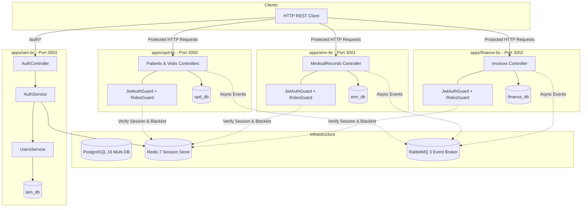
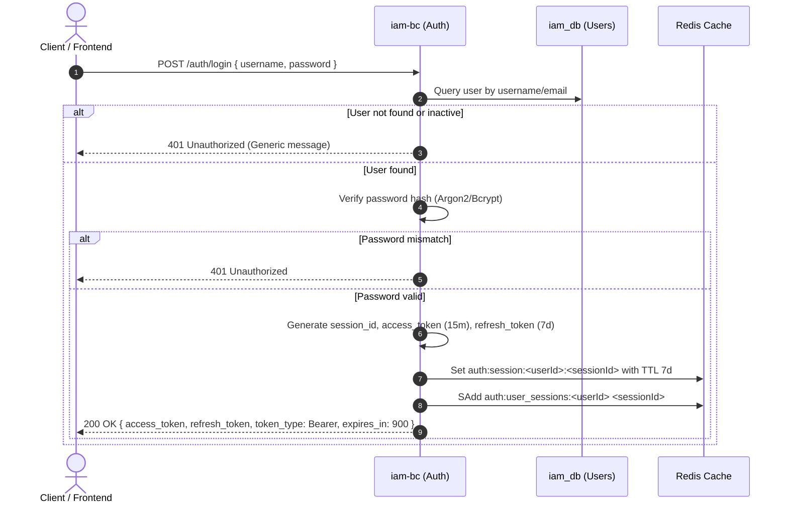
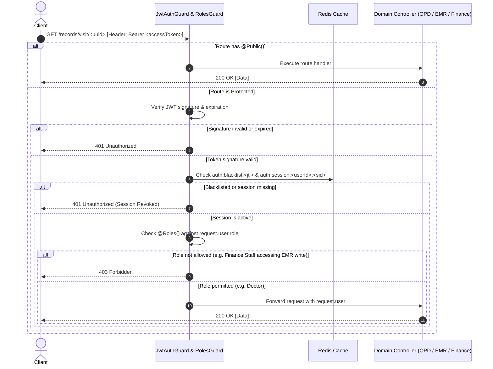
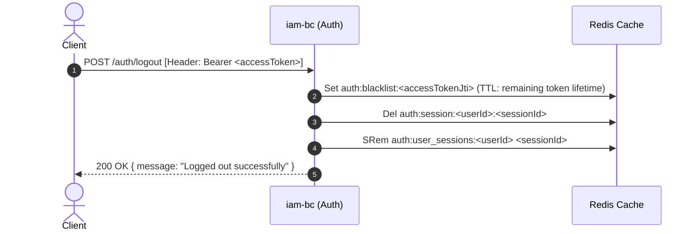

# Design Document: Identity & Access Management (iam-auth)

## Overview

This technical design specifies the architecture and implementation for Identity & Access Management (IAM), Stateful JWT Authentication backed by Redis, and Role-Based Access Control (RBAC) across the Hospital Information System (HIS) platform.

The design introduces a dedicated `iam-bc` microservice (Port `3003`, logical database `iam_db`), stateful session cache infrastructure in Redis, reusable security guards (`JwtAuthGuard`, `RolesGuard`) and decorators (`@Public()`, `@Roles()`, `@CurrentUser()`) in `@app/common`, and attaches authorization policies to existing endpoints across `opd-bc`, `emr-bc`, and `finance-bc` without altering existing event-driven choreographies.

### Goals
- Provide secure user registration, password hashing (Argon2id / bcrypt), and credential authentication.
- Issue short-lived Access Tokens (15m) and long-lived Refresh Tokens (7d) with automatic rotation and token-theft detection.
- Implement stateful session tracking and instant token revocation via Redis.
- Enforce healthcare RBAC roles (`ADMIN`, `DOCTOR`, `NURSE`, `FINANCE_STAFF`, `PATIENT`) across all domain endpoints.
- Return standardized Blueprint JSON:API error envelopes for `401 Unauthorized` and `403 Forbidden`.
- Maintain 100% backward compatibility and test stability for existing OPD, EMR, and Finance capabilities.

### Non-Goals
- Modifying domain entity schemas (`Patient`, `Visit`, `MedicalRecord`, `Invoice`) or domain database boundaries.
- Altering RabbitMQ asynchronous message queues and outbox publishers.
- External social logins (OAuth2, SAML, LDAP).
- Biometric verification or hardware TOTP tokens.

---

## Boundary Commitments

### This Spec Owns
- The `iam-bc` microservice application, configuration, modules, and `iam_db` persistence schemas (`users` table).
- Redis container configuration in `docker-compose.yml` and `RedisService` / `RedisModule` in `@app/common`.
- Authentication endpoints: `POST /auth/register`, `POST /auth/login`, `POST /auth/refresh`, `POST /auth/logout`, `GET /auth/me`.
- Token issuance, signature verification, token rotation, and revocation logic.
- Reusable `JwtAuthGuard`, `RolesGuard`, `@Roles()`, `@Public()`, and `@CurrentUser()` decorators in `@app/common`.
- Role assignment and permission annotations on `opd-bc`, `emr-bc`, and `finance-bc` controllers.
- Test authentication utilities in `testing.helpers.ts`.

### Out of Boundary
- OPD domain logic and persistence (`patients`, `visits`).
- EMR domain clinical logic and persistence (`medical_records`).
- Finance domain billing and payment persistence (`invoices`).
- Domain event routing keys and payloads in `@app/contracts`.

### Allowed Dependencies
- `iam-bc` depends on PostgreSQL (`iam_db`), Redis 7, `@app/common`, `@nestjs/jwt`, and password hashing libraries.
- `opd-bc`, `emr-bc`, and `finance-bc` depend on `@app/common` (which exports guards, decorators, and Redis verification client).
- Zero cross-database foreign keys or runtime RPC dependencies between domain microservices and `iam-bc`.

### Revalidation Triggers
- Changes to JWT payload claim names (`sub`, `username`, `role`, `sid`, `jti`).
- Changes to Redis key schemas for session validation or token revocation.
- Modifications to `UserRole` enum values.
- Breaking changes to Blueprint standard `401`/`403` error response envelopes.

---

## Architecture

### Architecture Pattern & Boundary Map



### Dependency Direction

```text
Libs: @app/contracts -> @app/common (Guards, Decorators, Redis, Logger)
Apps: apps/iam-bc       --> @app/common
      apps/opd-bc       --> @app/common, @app/contracts
      apps/emr-bc       --> @app/common, @app/contracts
      apps/finance-bc   --> @app/common, @app/contracts
```

### Technology Stack

| Layer | Choice / Version | Role in Feature | Notes |
| :--- | :--- | :--- | :--- |
| **Authentication Service** | NestJS 11 (`apps/iam-bc`) | Handles registration, login, refresh, logout | Standalone port `3003` |
| **Token Handling** | `@nestjs/jwt` + `jsonwebtoken` | Access & Refresh JWT generation & verification | RS256 or HS256 with strong secret |
| **Credential Security** | `argon2` / `bcrypt` | Salted one-way password hashing | High-work-factor hash |
| **Session Cache** | Redis 7 + `ioredis` | Stateful session storage & token blacklist | Sub-millisecond lookup, TTL eviction |
| **Database** | PostgreSQL 16 (`iam_db`) | Persistent user identity storage | Table `users` with constraint naming |
| **Authorization** | NestJS Reflector + Guards | RBAC verification on HTTP routes | `@Roles()` + `RolesGuard` |

---

## File Structure Plan

### New Files to Create

```text
his-project/
├── apps/iam-bc/
│   ├── src/
│   │   ├── main.ts                                  # IAM microservice bootstrap (Port 3003, Swagger)
│   │   ├── iam-bc.module.ts                         # IAM root module importing TypeOrm, Auth, Redis
│   │   ├── health-checks.controller.ts              # IAM health check endpoint
│   │   ├── health-checks.service.ts                 # Health check service
│   │   └── modules/
│   │       ├── auth/
│   │       │   ├── auth.module.ts                   # Auth module wiring controllers & services
│   │       │   ├── controllers/
│   │       │   │   └── auth.controller.ts           # /auth/register, /auth/login, /auth/refresh, /auth/logout, /auth/me
│   │       │   ├── dto/
│   │       │   │   ├── register-user.dto.ts         # User registration DTO with validation
│   │       │   │   ├── login-user.dto.ts            # Login DTO (username/email + password)
│   │       │   │   └── refresh-token.dto.ts         # Refresh token DTO
│   │       │   └── services/
│   │       │       ├── auth.service.ts              # Login, token pair creation, refresh, logout
│   │       │       └── password-hash.service.ts     # Password hashing & verification utility
│   │       └── user/
│   │           ├── user.module.ts                   # User module with repository
│   │           ├── entities/
│   │           │   └── user.entity.ts               # User entity (table: users, pk_users, uq_users_*)
│   │           └── services/
│   │               └── users.service.ts             # User creation, lookup by username/email/id
│   ├── test/
│   │   ├── jest-e2e.json                            # E2E test config for iam-bc
│   │   ├── unit/
│   │   │   ├── auth.controller.spec.ts              # Unit tests for AuthController
│   │   │   ├── auth.service.spec.ts                 # Unit tests for AuthService
│   │   │   ├── users.service.spec.ts                # Unit tests for UsersService
│   │   │   └── user-naming.spec.ts                  # Persistence naming test for User entity
│   │   └── e2e/
│   │       └── auth.e2e-spec.ts                     # Full registration, login, refresh, logout E2E
│   ├── jest.config.js                               # Unit test config for iam-bc
│   └── tsconfig.app.json                            # TypeScript configuration for iam-bc
│
└── libs/common/src/
    ├── auth/
    │   ├── auth-common.module.ts                    # Exports guards, token validator, Redis client
    │   ├── constants/
    │   │   └── user-roles.enum.ts                   # UserRole enum: ADMIN, DOCTOR, NURSE, FINANCE_STAFF, PATIENT
    │   ├── decorators/
    │   │   ├── roles.decorator.ts                   # @Roles(...roles: UserRole[])
    │   │   ├── public.decorator.ts                  # @Public() bypass decorator
    │   │   └── current-user.decorator.ts            # @CurrentUser() param decorator
    │   ├── guards/
    │   │   ├── jwt-auth.guard.ts                    # Global guard validating JWT + Redis session state
    │   │   └── roles.guard.ts                       # Global guard checking required user roles
    │   └── interfaces/
    │       └── authenticated-user.interface.ts      # AuthenticatedUser interface ({ id, username, role, sid })
    └── redis/
        ├── redis.module.ts                          # Redis connection provider using ioredis
        ├── redis.service.ts                         # Key-value operations, session store, token blacklist
        └── redis.config.ts                          # REDIS_HOST, REDIS_PORT, REDIS_PASSWORD loader
```

### Modified Files

- `docker-compose.yml`: Add `redis` service (image: `redis:7-alpine`, ports: `6379:6379`).
- `docker/postgres/init.sql`: Add `CREATE DATABASE iam_db;`.
- `his-project/nest-cli.json`: Register `iam-bc` application project.
- `his-project/tsconfig.json`: Add `@apps/iam-bc` path aliases.
- `his-project/package.json`: Add scripts `start:iam`, `start:prod:iam`, `test:iam`, and update `build` / `start:all`.
- `his-project/.env.example`: Add `IAM_PORT=3003`, `IAM_DATABASE_NAME=iam_db`, `REDIS_HOST=localhost`, `REDIS_PORT=6379`, `JWT_SECRET=...`.
- `libs/common/src/index.ts`: Export auth guards, decorators, roles enum, and Redis service.
- `libs/common/src/testing/testing.helpers.ts`: Add `createMockJwtToken()` and test auth header helpers.
- `apps/opd-bc/src/opd-bc.module.ts`, `apps/emr-bc/src/emr-bc.module.ts`, `apps/finance-bc/src/finance-bc.module.ts`: Import `AuthCommonModule` and attach global `JwtAuthGuard` & `RolesGuard`.
- Controllers in `opd-bc`, `emr-bc`, and `finance-bc`: Add `@Roles()` decorators to endpoints and `@Public()` to health checks.

---

## System Flows

### 1. Authentication & Token Issuance Flow



### 2. Protected Request & Role Verification Flow



### 3. Stateful Logout & Instant Revocation Flow



---

## Requirements Traceability

| Req ID | Requirement Summary | Components | Interfaces / DTOs | Flows |
| :--- | :--- | :--- | :--- | :--- |
| **1.1** | User registration with hashed password | `UsersService`, `AuthService` | `RegisterUserDTO`, `IUser` | Register Flow |
| **1.2** | Duplicate username/email rejection (`409 Conflict`) | `UsersService`, `AllExceptionsFilter` | `RegisterUserDTO` | Register Flow |
| **1.3** | Field validation on registration (`400 Bad Request`) | `StrictValidationPipe` | `RegisterUserDTO` | Validation |
| **1.4** | Active status & system roles assignment | `User` Entity | `UserRole` Enum | Register Flow |
| **2.1** | Login credentials verification & token pair issuance | `AuthService`, `AuthController` | `LoginUserDTO`, `TokenPairResponse` | Flow 1 |
| **2.2** | Generic `401 Unauthorized` on invalid credentials | `AuthService`, `AllExceptionsFilter` | `LoginUserDTO` | Flow 1 |
| **2.3** | Inactive user login rejection | `AuthService` | `User` Entity | Flow 1 |
| **2.4** | `GET /auth/me` identity profile retrieval | `AuthController`, `UsersService` | `UserProfileResponse` | Profile Flow |
| **3.1** | Stateful Redis token & session active verification | `JwtAuthGuard`, `RedisService` | `AuthenticatedUser` | Flow 2 |
| **3.2** | Token refresh with rotation & session renewal | `AuthService`, `AuthController` | `RefreshTokenDTO`, `TokenPairResponse` | Refresh Flow |
| **3.3** | Immediate token revocation on logout | `AuthService`, `RedisService` | `LogoutResponse` | Flow 3 |
| **3.4** | Rejection of revoked tokens with `401 Unauthorized` | `JwtAuthGuard`, `RedisService` | `AllExceptionsFilter` | Flow 2 |
| **3.5** | Token reuse detection & full user session termination | `AuthService`, `RedisService` | `RedisService` | Refresh Flow |
| **4.1** | RBAC verification on endpoint access | `RolesGuard` | `@Roles()` Decorator | Flow 2 |
| **4.2** | OPD patient/visit operations role enforcement | `PatientsController`, `VisitsController` | `@Roles(ADMIN, DOCTOR, NURSE)` | Flow 2 |
| **4.3** | EMR medical record creation/completion restricted to Doctor | `MedicalRecordsController` | `@Roles(DOCTOR)` | Flow 2 |
| **4.4** | EMR record viewing permissions | `MedicalRecordsController` | `@Roles(DOCTOR, NURSE, ADMIN, PATIENT)` | Flow 2 |
| **4.5** | Finance invoice payment restricted to Finance Staff / Admin | `InvoicesController` | `@Roles(FINANCE_STAFF, ADMIN)` | Flow 2 |
| **4.6** | Finance invoice viewing permissions | `InvoicesController` | `@Roles(FINANCE_STAFF, ADMIN, PATIENT)` | Flow 2 |
| **5.1** | Missing/expired/malformed token rejection (`401`) | `JwtAuthGuard` | Blueprint JSON:API Envelope | Flow 2 |
| **5.2** | Role mismatch rejection (`403 Forbidden`) | `RolesGuard` | Blueprint JSON:API Envelope | Flow 2 |
| **5.3** | Blueprint standard JSON:API error format | `AllExceptionsFilter` | `ApiErrorResponse` | All Errors |
| **5.4** | Public route whitelisting (`/`, `/docs`, `/auth/*`) | `@Public()` Decorator, `JwtAuthGuard` | `Reflector` | Flow 2 |
| **6.1** | Password complexity policy enforcement | `RegisterUserDTO` | `@IsStrongPassword()` / regex | Validation |
| **6.2** | Complexity violation detailed `400` error | `StrictValidationPipe` | `ApiErrorResponse` | Validation |
| **6.3** | Salted cryptographic one-way hashing | `PasswordHashService` | Argon2id / Bcrypt | Register Flow |
| **6.4** | Brute-force rate limiting backoff (`429`) | `AuthService`, `RedisService` | Rate Limiter | Flow 1 |
| **7.1** | Structured JSON security audit logging | `StructuredLogger` | `SecurityAuditPayload` | All Auth Actions |
| **7.2** | Trace metadata inclusion (`x-trace-id`, `x-correlation-id`) | `StructuredLogger`, `JwtAuthGuard` | Request Context | Logging |
| **7.3** | Redaction of passwords, tokens, secrets in logs | `StructuredLogger`, Interceptors | Logger Sanitizer | Logging |
| **7.4** | User context attachment to Request object | `JwtAuthGuard`, `@CurrentUser()` | `AuthenticatedUser` | Flow 2 |
| **8.1** | Idempotent logout handling | `AuthService`, `AuthController` | `LogoutResponse` | Flow 3 |
| **8.2** | Fail-closed `503 Service Unavailable` on Redis outage | `JwtAuthGuard`, `RedisService` | `AllExceptionsFilter` | Error Handling |
| **8.3** | Graceful Redis connection recovery | `RedisService` | `ioredis` Reconnect Strategy | Infrastructure |

---

## Components and Interfaces

### 1. IAM Bounded Context (`apps/iam-bc`)

#### `AuthController`
| Field | Detail |
| :--- | :--- |
| Intent | Exposes user registration, authentication, token refresh, logout, and self-profile endpoints |
| Requirements | 1.1, 1.2, 1.3, 2.1, 2.2, 2.4, 3.2, 3.3, 8.1 |

```typescript
@Controller('auth')
export class AuthController {
  @Public()
  @Post('register')
  register(@Body() dto: RegisterUserDTO): Promise<ApiSingleResponse<UserResponse>>;

  @Public()
  @Post('login')
  login(@Body() dto: LoginUserDTO): Promise<ApiSingleResponse<TokenPairResponse>>;

  @Public()
  @Post('refresh')
  refresh(@Body() dto: RefreshTokenDTO): Promise<ApiSingleResponse<TokenPairResponse>>;

  @Post('logout')
  logout(@CurrentUser() user: AuthenticatedUser, @Headers('authorization') authHeader: string): Promise<ApiSingleResponse<MessageResponse>>;

  @Get('me')
  getProfile(@CurrentUser() user: AuthenticatedUser): Promise<ApiSingleResponse<UserProfileResponse>>;
}
```

#### `AuthService`
| Field | Detail |
| :--- | :--- |
| Intent | Coordinates credential validation, token generation, Redis session storage, and token rotation |
| Requirements | 2.1, 2.2, 2.3, 3.1, 3.2, 3.3, 3.5, 6.3, 6.4, 8.1 |

```typescript
export interface TokenPairResponse {
  access_token: string;
  refresh_token: string;
  token_type: 'Bearer';
  expires_in: number;
}

export interface AuthService {
  register(dto: RegisterUserDTO): Promise<User>;
  login(dto: LoginUserDTO): Promise<TokenPairResponse>;
  refresh(refreshToken: string): Promise<TokenPairResponse>;
  logout(userId: string, sessionId: string, accessToken: string): Promise<void>;
}
```

---

### 2. Common Security Library (`libs/common`)

#### `JwtAuthGuard`
| Field | Detail |
| :--- | :--- |
| Intent | Global NestJS Guard that verifies JWT signature, validates active session in Redis, checks token blacklist, and injects `request.user` |
| Requirements | 3.1, 3.4, 5.1, 5.4, 7.4, 8.2 |

```typescript
@Injectable()
export class JwtAuthGuard implements CanActivate {
  constructor(
    private readonly reflector: Reflector,
    private readonly jwtService: JwtService,
    private readonly redisService: RedisService,
    private readonly logger: StructuredLogger,
  ) {}

  async canActivate(context: ExecutionContext): Promise<boolean>;
}
```

#### `RolesGuard`
| Field | Detail |
| :--- | :--- |
| Intent | Inspects `@Roles()` metadata and compares required roles against authenticated user role, throwing `403 Forbidden` on mismatch |
| Requirements | 4.1, 4.2, 4.3, 4.4, 4.5, 4.6, 5.2 |

```typescript
@Injectable()
export class RolesGuard implements CanActivate {
  constructor(private readonly reflector: Reflector) {}

  canActivate(context: ExecutionContext): boolean;
}
```

#### `RedisService`
| Field | Detail |
| :--- | :--- |
| Intent | High-performance Redis client managing session metadata, refresh token pointers, and revoked token blacklists |
| Requirements | 3.1, 3.2, 3.3, 3.4, 3.5, 8.2, 8.3 |

```typescript
export interface SessionMetadata {
  userId: string;
  username: string;
  role: UserRole;
  refreshTokenJti: string;
  createdAt: string;
}

export interface RedisService {
  createSession(userId: string, sessionId: string, meta: SessionMetadata, ttlSeconds: number): Promise<void>;
  getSession(userId: string, sessionId: string): Promise<SessionMetadata | null>;
  updateSessionRefreshToken(userId: string, sessionId: string, newRefreshTokenJti: string): Promise<void>;
  revokeSession(userId: string, sessionId: string): Promise<void>;
  revokeAllUserSessions(userId: string): Promise<void>;
  blacklistAccessToken(jti: string, ttlSeconds: number): Promise<void>;
  isAccessTokenBlacklisted(jti: string): Promise<boolean>;
}
```

---

## Data Models

### Physical Data Model (`iam_db`)

```sql
CREATE TYPE user_role_enum AS ENUM ('ADMIN', 'DOCTOR', 'NURSE', 'FINANCE_STAFF', 'PATIENT');

CREATE TABLE users (
    id UUID NOT NULL DEFAULT gen_random_uuid(),
    username VARCHAR(100) NOT NULL,
    email VARCHAR(255) NOT NULL,
    password_hash VARCHAR(255) NOT NULL,
    first_name VARCHAR(100) NOT NULL,
    last_name VARCHAR(100) NOT NULL,
    role user_role_enum NOT NULL DEFAULT 'PATIENT',
    is_active BOOLEAN NOT NULL DEFAULT TRUE,
    created_at TIMESTAMP WITH TIME ZONE NOT NULL DEFAULT NOW(),
    updated_at TIMESTAMP WITH TIME ZONE NOT NULL DEFAULT NOW(),
    CONSTRAINT pk_users PRIMARY KEY (id),
    CONSTRAINT uq_users_username UNIQUE (username),
    CONSTRAINT uq_users_email UNIQUE (email)
);

CREATE INDEX idx_users_role ON users(role);
CREATE INDEX idx_users_is_active ON users(is_active);
```

### Redis Key Schema

| Key Pattern | Data Type | Value / Payload | TTL | Purpose |
| :--- | :--- | :--- | :--- | :--- |
| `auth:session:{userId}:{sessionId}` | `string (JSON)` | `SessionMetadata` object | 7 days (604800s) | Tracks active session & valid refresh token JTI |
| `auth:user_sessions:{userId}` | `set` | Set of `{sessionId}` strings | 7 days | Enables multi-session lookup and revocation on theft |
| `auth:blacklist:{accessTokenJti}` | `string` | `"revoked"` | Remaining Access Token TTL (~15m) | Fast O(1) blacklist check on incoming requests |
| `auth:ratelimit:login:{ipOrUsername}` | `string` | Attempt counter | 15 minutes (900s) | Brute-force rate limiting backoff |

---

## Error Handling & Failure Modes

| Failure Scenario | Error Code | HTTP Status | System Response & Behavior |
| :--- | :---: | :---: | :--- |
| **Missing / Expired Bearer Token** | `401000` | `401 Unauthorized` | Rejected immediately by `JwtAuthGuard`; returns standard Blueprint error pointer. |
| **Token JTI on Blacklist (Logged out)** | `401000` | `401 Unauthorized` | Rejected by `JwtAuthGuard` with message `Session has been revoked`. |
| **Insufficient Role Privileges** | `403000` | `403 Forbidden` | Rejected by `RolesGuard`; logs security warning; returns forbidden envelope. |
| **User Registration Duplicate** | `409000` | `409 Conflict` | Throws `ConflictException` when username or email already exists. |
| **Weak Password** | `400001` | `400 Bad Request` | Rejected by `StrictValidationPipe` with pointer to `/data/attributes/password`. |
| **Redis Outage (Fail-Closed)** | `503000` | `503 Service Unavailable` | `JwtAuthGuard` catches Redis connection failure, emits structured critical log, fails closed safely. |
| **Redis Recovery** | N/A | Normal (`200`/`201`) | `ioredis` automatically reconnects and normal verification resumes without service restart. |

---

## Testing Strategy

### Unit Tests
- `auth.controller.spec.ts`: Test route handling, DTO mapping, and response envelopes for register, login, refresh, logout, `/auth/me`.
- `auth.service.spec.ts`: Test password verification, JWT creation, token rotation, and theft detection (revoking all sessions on reuse).
- `users.service.spec.ts`: Test user creation, duplicate checks, and lookups.
- `jwt-auth.guard.spec.ts`: Test `@Public()` bypass, valid token acceptance, expired token rejection, blacklisted token rejection, and Redis fail-closed.
- `roles.guard.spec.ts`: Test allowed role execution, forbidden role rejection (`403`), and route with no role requirements.
- `user-naming.spec.ts`: Persistence naming test verifying `users` table, `pk_users`, `uq_users_username`, `uq_users_email`.

### Integration & E2E Tests
- `auth.e2e-spec.ts`: Full HTTP lifecycle test for `iam-bc` (Register → Login → Access Profile → Refresh Token → Logout → Verify Old Token Rejected).
- **Cross-Service Auth Protection E2E**:
  - Verify unauthenticated requests to `POST /patients`, `POST /visits`, `POST /records`, `PATCH /invoices/:id/pay` return `401 Unauthorized`.
  - Verify `DOCTOR` token can complete medical record, but returns `403 Forbidden` when attempting invoice payment.
  - Verify `FINANCE_STAFF` token can pay invoice, but returns `403 Forbidden` when attempting medical record creation.
- **Existing 142 Test Compatibility**:
  - Update `testing.helpers.ts` with test token helper so all 34 existing test suites continue to execute and pass with 100% success rate.
