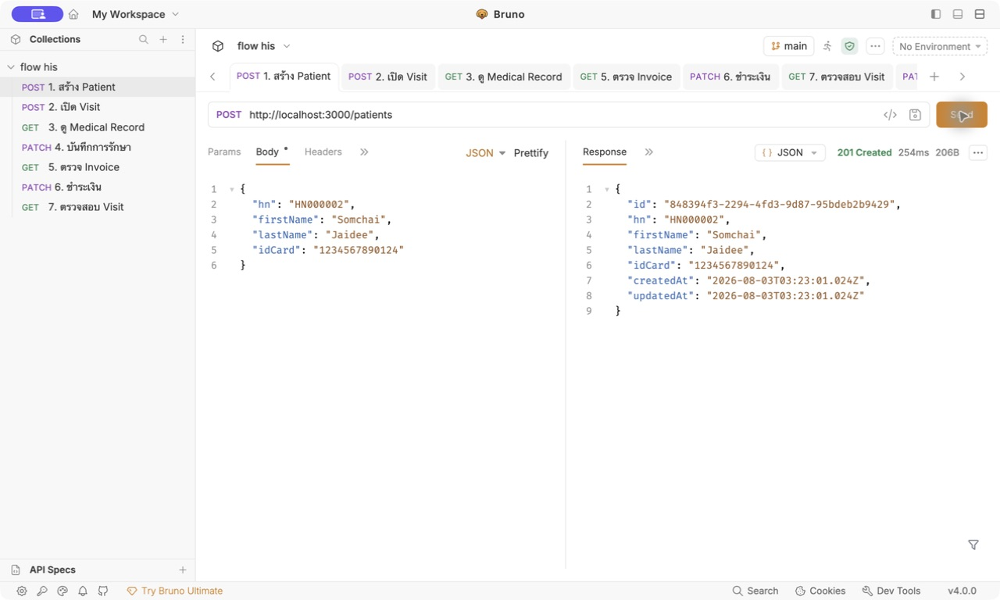
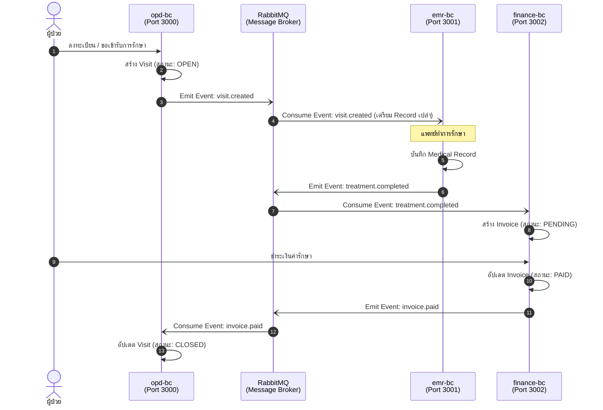

<div align="center">

# Hospital Information System

### Event-Driven Microservices with NestJS

ระบบสารสนเทศโรงพยาบาลที่แยกความรับผิดชอบเป็น **OPD**, **EMR** และ **Finance**<br>
แต่ละ service มีฐานข้อมูลของตัวเองและสื่อสารข้าม service ผ่าน RabbitMQ events

</div>

## ภาพรวมระบบ

ระบบรองรับ Flow หลักตั้งแต่ลงทะเบียนผู้ป่วยจนปิด Visit หลังชำระเงินครบแล้ว:

```text
Patient → Visit (OPEN) → Medical Record (WAITING)
        → Treatment (COMPLETED) → Invoice (PENDING)
        → Payment (PAID) → Visit (CLOSED)
```

| Bounded Context | Port | ดูแลข้อมูล | Database |
| --- | ---: | --- | --- |
| OPD | `3000` | Patient, Visit | `opd_db` |
| EMR | `3001` | Medical Record, Treatment | `emr_db` |
| Finance | `3002` | Invoice, Payment | `finance_db` |

> Service แต่ละตัวเข้าถึงเฉพาะ database ของตัวเอง ไม่มี cross-database join หรือ transaction ข้าม service

## Main Flow

### 1. สร้าง Patient

```http
POST http://localhost:3000/patients
Content-Type: application/json
```

```json
{
  "hn": "HN-0001",
  "firstName": "สมชาย",
  "lastName": "ใจดี",
  "idCard": "1234567890123"
}
```

เก็บค่า `id` จาก response ไว้เป็น `patientId` สำหรับขั้นตอนถัดไป



### 2. สร้าง Visit

```http
POST http://localhost:3000/visits
Content-Type: application/json
```

```json
{
  "patientId": "<PATIENT_ID>"
}
```

Visit เริ่มต้นด้วยสถานะ `OPEN` จากนั้น OPD ส่ง event `visit.created` ไปยัง EMR


### 3. EMR สร้าง Medical Record อัตโนมัติ

เมื่อ EMR ได้รับ `visit.created` จะสร้าง Medical Record สถานะ `WAITING` โดยอัตโนมัติ

```http
GET http://localhost:3001/records/visit/<VISIT_ID>
```

เก็บค่า `id` ของ Record ไว้เป็น `recordId`


### 4. หมอบันทึกผลการรักษา

Route หลัก:

```http
PATCH http://localhost:3001/records/<RECORD_ID>
Content-Type: application/json
```

```json
{
  "doctorId": "doctor-001",
  "diagnosis": "ไข้หวัดทั่วไป",
  "treatmentNote": "ให้ยาลดไข้และพักผ่อน",
  "treatmentCost": 1500,
  "status": "COMPLETED"
}
```

Route เดิมที่ยังรองรับ:

```http
PATCH http://localhost:3001/records/<RECORD_ID>/complete
Content-Type: application/json
```

```json
{
  "doctorId": "doctor-001",
  "diagnosis": "ไข้หวัดทั่วไป",
  "treatmentNote": "ให้ยาลดไข้และพักผ่อน",
  "treatmentCost": 1500
}
```

เมื่อ Record เปลี่ยนเป็น `COMPLETED` ระบบจะส่ง event `treatment.completed` ไปยัง Finance


### 5. Finance สร้าง Invoice อัตโนมัติ

Finance สร้าง Invoice สถานะ `PENDING` จาก `treatment.completed` โดยไม่มี public API สำหรับสร้าง Invoice โดยตรง

```http
GET http://localhost:3002/invoices/<VISIT_ID>
```

เก็บค่า `id` ของ Invoice ไว้เป็น `invoiceId`


### 6. ชำระเงิน

```http
PATCH http://localhost:3002/invoices/<INVOICE_ID>/pay
Content-Type: application/json
```

```json
{
  "status": "PAID"
}
```

เมื่อชำระสำเร็จ Invoice เปลี่ยนเป็น `PAID` และ Finance ส่ง event `invoice.paid` กลับไปยัง OPD


### 7. OPD ปิด Visit

OPD รับ `invoice.paid` แล้วเปลี่ยนสถานะ Visit เป็น `CLOSED` ตรวจสอบได้ด้วย:

```http
GET http://localhost:3000/visits/<VISIT_ID>
```


## Event Flow



Consumers รองรับ idempotency เพื่อป้องกันผลลัพธ์ซ้ำจาก event เดิม เช่น หนึ่ง Visit มี Invoice หลักเพียงหนึ่งใบ และ Visit ที่ปิดแล้วจะยังคงเป็น `CLOSED` เมื่อได้รับ payment event ซ้ำ

## API ที่รองรับ

| Service | Method | Endpoint | รายละเอียด |
| --- | --- | --- | --- |
| OPD | `POST` | `/patients` | สร้าง Patient |
| OPD | `GET` | `/patients` | ดู Patient ทั้งหมด |
| OPD | `GET` | `/patients/:id` | ดู Patient ตาม ID |
| OPD | `PATCH` | `/patients/:id` | แก้ไข Patient |
| OPD | `DELETE` | `/patients/:id` | ลบ Patient |
| OPD | `POST` | `/visits` | สร้าง Visit |
| OPD | `GET` | `/visits` | ดู Visit ทั้งหมด |
| OPD | `GET` | `/visits/:id` | ดู Visit ตาม ID |
| OPD | `GET` | `/patients/:patientId/visits` | ดู Visit ของ Patient |
| EMR | `GET` | `/records` | ดู Record ทั้งหมด |
| EMR | `GET` | `/records/:id` | ดู Record ตาม ID |
| EMR | `GET` | `/records/visit/:visitId` | ดู Record ตาม Visit |
| EMR | `PATCH` | `/records/:id` | แก้ไข/บันทึกผลการรักษา |
| EMR | `PATCH` | `/records/:id/complete` | ปิดการรักษาด้วย route เดิม |
| Finance | `GET` | `/invoices` | ดู Invoice ทั้งหมด |
| Finance | `GET` | `/invoices/:visitId` | ดู Invoice ตาม Visit |
| Finance | `PATCH` | `/invoices/:id/pay` | ชำระ Invoice |

## การติดตั้งและรันระบบ

สิ่งที่ต้องมี: Node.js, npm และ Docker Desktop หรือ Docker Engine ที่รองรับ Compose

### 1. เริ่ม PostgreSQL และ RabbitMQ

รันจาก root ของ repository:

```bash
docker compose up -d
```

RabbitMQ Management UI เปิดได้ที่ [http://localhost:15672](http://localhost:15672) โดยใช้ `guest` / `guest`

### 2. ติดตั้ง dependencies และตั้งค่า environment

```bash
cd his-project
npm install
cp .env.example .env
```

### 3. เปิดทั้ง 3 services

เปิดแยกกัน 3 terminals โดยรันจาก `his-project/`:

```bash
# Terminal 1 — OPD
npm run start:dev
```

```bash
# Terminal 2 — EMR
npm run start:emr
```

```bash
# Terminal 3 — Finance
npm run start:finance
```

## Testing

รันคำสั่งจาก `his-project/`:

```bash
# Unit tests
npm test

# End-to-end tests ของทั้ง 3 services
npm run test:e2e

# Build ทุก service
npm run build
```

## Error Handling และ Logging

ระบบมี request validation และ error response หลัก ได้แก่:

- `400 Bad Request` — request body หรือ parameter ไม่ถูกต้อง
- `404 Not Found` — ไม่พบ resource
- `409 Conflict` — business state ขัดแย้ง เช่น ชำระ Invoice ซ้ำ
- `503 Service Unavailable` — ไม่สามารถ publish event ไปยัง message broker

ทุก service เขียน structured log ผ่าน console พร้อมข้อมูลสำคัญ เช่น service, event name, event ID, correlation ID, visit ID และสถานะการ publish

สามารถส่ง header `x-correlation-id` มากับ request ที่เริ่ม business flow เพื่อช่วยติดตามเหตุการณ์ข้าม service ได้

## Project Structure

```text
his-project/
├── apps/
│   ├── opd-bc/          # Patient และ Visit
│   ├── emr-bc/          # Medical Record และ Treatment
│   └── finance-bc/      # Invoice และ Payment
└── libs/
    ├── common/          # Logging, validation, RabbitMQ, idempotency
    └── contracts/       # Shared event names และ payload contracts
```

## Current Scope

- ✅ Main business flow ตั้งแต่สร้าง Patient จนปิด Visit
- ✅ Event-driven communication ผ่าน durable RabbitMQ exchange/queues
- ✅ Idempotent event consumers
- ✅ Validation, error handling และ structured logging
- ⏳ Authentication / Authorization และ response `401/403` อยู่ในแผน Week 4 และยังไม่ใช่ Flow ปัจจุบัน
