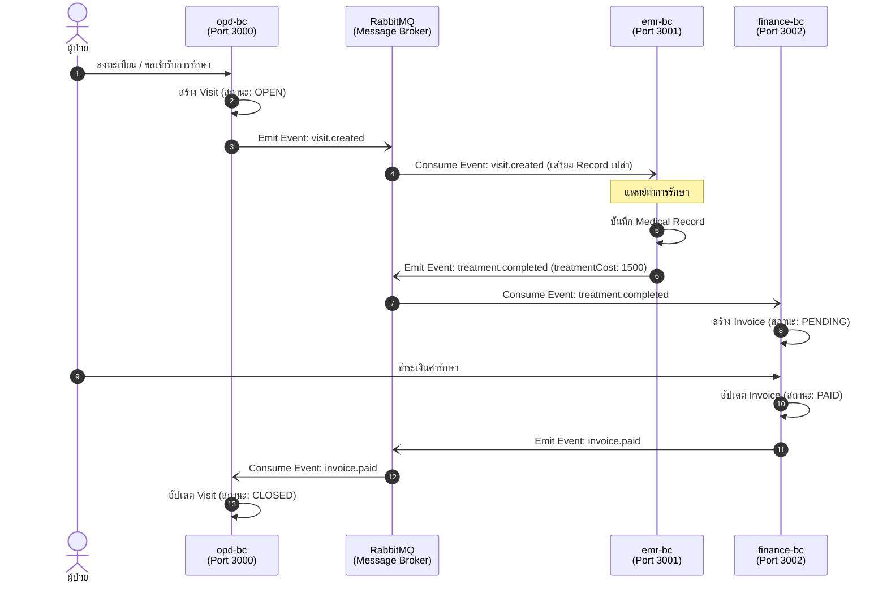

<div align="center">

# Hospital Information System

### Event-Driven Microservices with NestJS

ระบบสารสนเทศโรงพยาบาลที่แยกความรับผิดชอบเป็น **OPD**, **EMR** และ **Finance**<br>
แต่ละ service มีฐานข้อมูลของตัวเองและสื่อสารข้าม service ผ่าน RabbitMQ events ตามมาตรฐาน [Enterprise Backend Blueprint](https://iots1.github.io/enterprise-backend-blueprint/)

</div>

## ภาพรวมระบบ

ระบบรองรับ Flow หลักตั้งแต่ลงทะเบียนผู้ป่วยจนปิด Visit หลังชำระเงินครบแล้ว:

```text
Patient → Visit (OPEN) → Medical Record (WAITING)
        → Treatment (COMPLETED) → Invoice (PENDING)
        → Payment (PAID) → Visit (CLOSED)
```

| Bounded Context | Port | ดูแลข้อมูล | Database | Swagger UI |
| --- | ---: | --- | --- | --- |
| **OPD** | `3000` | Patient, Visit | `opd_db` | [http://localhost:3000/docs](http://localhost:3000/docs) |
| **EMR** | `3001` | Medical Record, Treatment | `emr_db` | [http://localhost:3001/docs](http://localhost:3001/docs) |
| **Finance** | `3002` | Invoice, Payment | `finance_db` | [http://localhost:3002/docs](http://localhost:3002/docs) |

> Service แต่ละตัวเข้าถึงเฉพาะ database ของตัวเอง ไม่มี cross-database join หรือ transaction ข้าม service

---

## มาตรฐาน API Response & Error Handling (Blueprint Compliant)

API ทั้งหมดถูก Wrap ด้วย **JSON:API Envelope** อัตโนมัติผ่าน `TransformInterceptor` และ `AllExceptionsFilter` ตามเกณฑ์ Blueprint:

### 1. Success Response Envelope
```json
{
  "status": {
    "code": 200000,
    "message": "Request Succeeded"
  },
  "data": {
    "type": "resource-name",
    "id": "uuid",
    "attributes": {
      "field_name": "value"
    }
  },
  "meta": {
    "timestamp": "2026-08-24T10:00:00.000Z"
  },
  "links": {
    "self": "/resource-path"
  }
}
```

* **Business Codes**: คำนวณจาก `HTTP Status × 1000` เช่น `200` $\rightarrow$ `200000`, `201` $\rightarrow$ `201000`
* **Resource Structure**: แยก `id` ไประดับบน และรวม properties อื่นไว้ใน `attributes`

### 2. Error Response Envelope
```json
{
  "status": {
    "code": 404,
    "message": "Resource Not Found"
  },
  "errors": [
    {
      "code": "404",
      "title": "NotFoundException",
      "detail": "Resource with ID '...' not found"
    }
  ],
  "meta": {
    "timestamp": "2026-08-24T10:00:00.000Z"
  },
  "links": {
    "self": "/resource-path"
  }
}
```

| Exception Type | Business Code | Trigger |
| --- | --- | --- |
| `ValidationException` | `400001` | Body validation ล้มเหลว (`class-validator`) |
| `InvalidParameterException` | `400002` | Query/Param validation ล้มเหลว |
| `NotFoundException` | `404` | ไม่พบข้อมูลในระบบ |
| `ConflictException` | `409` | สถานะซ้ำซ้อน (เช่น จ่ายเงินซ้ำ) |
| `ServiceUnavailableException` | `503` | Database หรือ Dependency ใช้งานไม่ได้ |

---

## Main Flow

### 1. สร้าง Patient (OPD)

```http
POST http://localhost:3000/patients
Content-Type: application/json
```

**Request Body:**
```json
{
  "hn": "HN-0001",
  "first_name": "สมชาย",
  "last_name": "ใจดี",
  "id_card": "1234567890123"
}
```

**Response (`201 Created`):**
```json
{
  "status": {
    "code": 201000,
    "message": "Request Succeeded"
  },
  "data": {
    "type": "patients",
    "id": "6ba7b810-9dad-41d1-80b4-00c04fd430c8",
    "attributes": {
      "hn": "HN-0001",
      "first_name": "สมชาย",
      "last_name": "ใจดี",
      "id_card": "1234567890123",
      "created_at": "2026-08-24T10:00:00.000Z",
      "updated_at": "2026-08-24T10:00:00.000Z"
    }
  },
  "meta": {
    "timestamp": "2026-08-24T10:00:00.000Z"
  },
  "links": {
    "self": "/patients"
  }
}
```

เก็บค่า `data.id` ไว้เป็น `PATIENT_UUID` สำหรับขั้นตอนถัดไป


---

### 2. สร้าง Visit (OPD)

```http
POST http://localhost:3000/visits
Content-Type: application/json
```

**Request Body:**
```json
{
  "patient_id": "<PATIENT_UUID>"
}
```

**Response (`201 Created`):**
```json
{
  "status": {
    "code": 201000,
    "message": "Request Succeeded"
  },
  "data": {
    "type": "visits",
    "id": "550e8400-e29b-41d4-a716-446655440000",
    "attributes": {
      "patient_id": "6ba7b810-9dad-41d1-80b4-00c04fd430c8",
      "status": "OPEN",
      "visit_date": "2026-08-24T10:05:00.000Z",
      "updated_at": "2026-08-24T10:05:00.000Z"
    }
  },
  "meta": {
    "timestamp": "2026-08-24T10:05:00.000Z"
  },
  "links": {
    "self": "/visits"
  }
}
```

Visit เริ่มต้นด้วยสถานะ `OPEN` จากนั้น OPD ส่ง event `visit.created` ไปยัง EMR ผ่าน RabbitMQ


---

### 3. EMR รับ Event และสร้าง Medical Record อัตโนมัติ

เมื่อ EMR ได้รับ event `visit.created` จะสร้าง Medical Record สถานะ `WAITING` โดยอัตโนมัติ

```http
GET http://localhost:3001/records/visit/<VISIT_UUID>
```

**Response (`200 OK`):**
```json
{
  "status": {
    "code": 200000,
    "message": "Request Succeeded"
  },
  "data": {
    "type": "medical-records",
    "id": "7c9e6679-7425-40de-944b-e07fc1f90ae7",
    "attributes": {
      "visit_id": "550e8400-e29b-41d4-a716-446655440000",
      "patient_id": "6ba7b810-9dad-41d1-80b4-00c04fd430c8",
      "doctor_id": null,
      "diagnosis": null,
      "treatment_note": null,
      "treatment_cost": null,
      "status": "WAITING",
      "created_at": "2026-08-24T10:05:01.000Z",
      "updated_at": "2026-08-24T10:05:01.000Z"
    }
  },
  "meta": {
    "timestamp": "2026-08-24T10:05:05.000Z"
  },
  "links": {
    "self": "/records/visit/550e8400-e29b-41d4-a716-446655440000"
  }
}
```

เก็บค่า `data.id` ไว้เป็น `RECORD_UUID` สำหรับขั้นตอนบันทึกการรักษา


---

### 4. แพทย์บันทึกผลการรักษา (EMR)

```http
PATCH http://localhost:3001/records/<RECORD_UUID>/complete
Content-Type: application/json
```

**Request Body:**
```json
{
  "doctor_id": "doctor-001",
  "diagnosis": "ไข้หวัดทั่วไป",
  "treatment_note": "ให้ยาลดไข้และพักผ่อน",
  "treatment_cost": 1500
}
```

**Response (`200 OK`):**
```json
{
  "status": {
    "code": 200000,
    "message": "Request Succeeded"
  },
  "data": {
    "type": "medical-records",
    "id": "7c9e6679-7425-40de-944b-e07fc1f90ae7",
    "attributes": {
      "visit_id": "550e8400-e29b-41d4-a716-446655440000",
      "patient_id": "6ba7b810-9dad-41d1-80b4-00c04fd430c8",
      "doctor_id": "doctor-001",
      "diagnosis": "ไข้หวัดทั่วไป",
      "treatment_note": "ให้ยาลดไข้และพักผ่อน",
      "treatment_cost": 1500,
      "status": "COMPLETED",
      "created_at": "2026-08-24T10:05:01.000Z",
      "updated_at": "2026-08-24T10:10:00.000Z"
    }
  },
  "meta": {
    "timestamp": "2026-08-24T10:10:00.000Z"
  },
  "links": {
    "self": "/records/7c9e6679-7425-40de-944b-e07fc1f90ae7/complete"
  }
}
```

เมื่อ Record เปลี่ยนเป็น `COMPLETED` EMR จะส่ง event `treatment.completed` (`treatmentCost: 1500`) ไปยัง Finance


---

### 5. Finance รับ Event และสร้าง Invoice อัตโนมัติ

Finance สร้าง Invoice สถานะ `PENDING` จาก event `treatment.completed`

```http
GET http://localhost:3002/invoices/<VISIT_UUID>
```

**Response (`200 OK`):**
```json
{
  "status": {
    "code": 200000,
    "message": "Request Succeeded"
  },
  "data": [
    {
      "type": "invoices",
      "id": "9b1deb4d-3b7d-4bad-9bdd-2b0d7b3dcb6d",
      "attributes": {
        "visit_id": "550e8400-e29b-41d4-a716-446655440000",
        "record_id": "7c9e6679-7425-40de-944b-e07fc1f90ae7",
        "total_amount": "1500.00",
        "status": "PENDING",
        "paid_at": null,
        "created_at": "2026-08-24T10:10:01.000Z",
        "updated_at": "2026-08-24T10:10:01.000Z"
      }
    }
  ],
  "meta": {
    "timestamp": "2026-08-24T10:10:05.000Z"
  },
  "links": {
    "self": "/invoices/550e8400-e29b-41d4-a716-446655440000"
  }
}
```

เก็บค่า `data[0].id` ไว้เป็น `INVOICE_UUID` สำหรับการชำระเงิน


---

### 6. ชำระเงินค่ารักษา (Finance)

```http
PATCH http://localhost:3002/invoices/<INVOICE_UUID>/pay
Content-Type: application/json
```

**Request Body:**
```json
{
  "status": "PAID"
}
```

**Response (`200 OK`):**
```json
{
  "status": {
    "code": 200000,
    "message": "Request Succeeded"
  },
  "data": {
    "type": "invoices",
    "id": "9b1deb4d-3b7d-4bad-9bdd-2b0d7b3dcb6d",
    "attributes": {
      "visit_id": "550e8400-e29b-41d4-a716-446655440000",
      "record_id": "7c9e6679-7425-40de-944b-e07fc1f90ae7",
      "total_amount": "1500.00",
      "status": "PAID",
      "paid_at": "2026-08-24T10:15:00.000Z",
      "created_at": "2026-08-24T10:10:01.000Z",
      "updated_at": "2026-08-24T10:15:00.000Z"
    }
  },
  "meta": {
    "timestamp": "2026-08-24T10:15:00.000Z"
  },
  "links": {
    "self": "/invoices/9b1deb4d-3b7d-4bad-9bdd-2b0d7b3dcb6d/pay"
  }
}
```

เมื่อชำระสำเร็จ Invoice เปลี่ยนเป็น `PAID` และ Finance ส่ง event `invoice.paid` กลับไปยัง OPD


---

### 7. OPD รับ Event และปิด Visit

OPD รับ `invoice.paid` แล้วเปลี่ยนสถานะ Visit เป็น `CLOSED` ตรวจสอบได้ด้วย:

```http
GET http://localhost:3000/visits/<VISIT_UUID>
```

**Response (`200 OK`):**
```json
{
  "status": {
    "code": 200000,
    "message": "Request Succeeded"
  },
  "data": {
    "type": "visits",
    "id": "550e8400-e29b-41d4-a716-446655440000",
    "attributes": {
      "patient_id": "6ba7b810-9dad-41d1-80b4-00c04fd430c8",
      "status": "CLOSED",
      "visit_date": "2026-08-24T10:05:00.000Z",
      "updated_at": "2026-08-24T10:15:01.000Z"
    }
  },
  "meta": {
    "timestamp": "2026-08-24T10:15:05.000Z"
  },
  "links": {
    "self": "/visits/550e8400-e29b-41d4-a716-446655440000"
  }
}
```


---

## Event Flow


```mermaid
sequenceDiagram
    autonumber
    actor Patient as ผู้ป่วย
    participant OPD as opd-bc<br/>(Port 3000)
    participant RMQ as RabbitMQ<br/>(Message Broker)
    participant EMR as emr-bc<br/>(Port 3001)
    participant FIN as finance-bc<br/>(Port 3002)

    Patient->>OPD: ลงทะเบียน / ขอเข้ารับการรักษา
    OPD->>OPD: สร้าง Visit (สถานะ: OPEN)
    OPD-)RMQ: Emit Event: visit.created
    RMQ-)EMR: Consume Event: visit.created (เตรียม Record เปล่า)

    Note over EMR: แพทย์ทำการรักษา
    EMR->>EMR: บันทึก Medical Record
    EMR-)RMQ: Emit Event: treatment.completed (treatmentCost: 1500)

    RMQ-)FIN: Consume Event: treatment.completed
    FIN->>FIN: สร้าง Invoice (สถานะ: PENDING)

    Patient->>FIN: ชำระเงินค่ารักษา
    FIN->>FIN: อัปเดต Invoice (สถานะ: PAID)
    FIN-)RMQ: Emit Event: invoice.paid

    RMQ-)OPD: Consume Event: invoice.paid
    OPD->>OPD: อัปเดต Visit (สถานะ: CLOSED)
```

Consumers รองรับ idempotency เพื่อป้องกันผลลัพธ์ซ้ำจาก event เดิม เช่น หนึ่ง Visit มี Invoice หลักเพียงหนึ่งใบ และ Visit ที่ปิดแล้วจะยังคงเป็น `CLOSED` เมื่อได้รับ payment event ซ้ำ

Outgoing events are persisted in a service-local `outbox_events` table in the
same transaction as the aggregate change. A background publisher retries rows
that are still pending, and consumers remain idempotent if a publish is retried.

---

## API ที่รองรับ

| Service | Method | Endpoint | Swagger Description |
| --- | --- | --- | --- |
| **OPD** | `POST` | `/patients` | Create patient |
| **OPD** | `GET` | `/patients` | Get all patients |
| **OPD** | `GET` | `/patients/:id` | Get patient by ID |
| **OPD** | `PATCH` | `/patients/:id` | Update patient |
| **OPD** | `DELETE` | `/patients/:id` | Delete patient |
| **OPD** | `POST` | `/visits` | Create visit |
| **OPD** | `GET` | `/visits` | Get all visits |
| **OPD** | `GET` | `/visits/:id` | Get visit by ID |
| **OPD** | `GET` | `/patients/:patientId/visits` | Get visits by patient ID |
| **EMR** | `GET` | `/records` | Get all medical records |
| **EMR** | `POST` | `/records` | Create medical record |
| **EMR** | `GET` | `/records/:id` | Get medical record by ID |
| **EMR** | `GET` | `/records/visit/:visitId` | Get medical record by visit ID |
| **EMR** | `PATCH` | `/records/:id` | Update medical record |
| **EMR** | `PATCH` | `/records/:id/complete` | Complete treatment |
| **Finance** | `GET` | `/invoices` | Get all invoices |
| **Finance** | `GET` | `/invoices/:visitId` | Get invoice by visit ID |
| **Finance** | `PATCH` | `/invoices/:id/pay` | Pay invoice |

---

## การติดตั้งและรันระบบ

สามารถนำเข้า [Postman Collection](docs/postman/his.postman_collection.json) เพื่อทดสอบ happy path ตั้งแต่เปิด Visit จนถึงปิด Visit ได้

สิ่งที่ต้องมี: Node.js, npm และ Docker Desktop หรือ Docker Engine ที่รองรับ Compose

### 1. เริ่ม PostgreSQL และ RabbitMQ

รันจาก root ของ repository:

```bash
docker compose up -d
```

RabbitMQ Management UI เปิดได้ที่ [http://localhost:15672](http://localhost:15672) โดยใช้ `guest` / `guest`

### 2. ติดตั้ง dependencies และตั้งค่า environment

```bash
cd his-project
npm install
cp .env.example .env
```

### 3. เปิดทั้ง 3 services

เปิดแยกกัน 3 terminals โดยรันจาก `his-project/`:

```bash
# Terminal 1 — OPD
npm run start:dev
```

```bash
# Terminal 2 — EMR
npm run start:emr
```

```bash
# Terminal 3 — Finance
npm run start:finance
```

---

## Testing

รันคำสั่งจาก `his-project/`:

```bash
# Unit tests (142 tests passing)
npm test

# Coverage-enforced unit and integration tests
npm run test:cov

# Full lint check
npm run lint:check

# End-to-end tests ของทั้ง 3 services
npm run test:e2e

# Build ทุก service
npm run build

# Live HTTP + RabbitMQ flow (requires all services and infrastructure)
npm run test:flow
```

---

## Error Handling และ Logging

ระบบมี request validation และ error response ตามมาตรฐาน Blueprint:

- `400 Bad Request` — request body หรือ parameter ไม่ถูกต้อง (Business Code: `400001` สำหรับ body, `400002` สำหรับ query/param)
- `404 Not Found` — ไม่พบ resource
- `409 Conflict` — business state ขัดแย้ง เช่น ชำระ Invoice ซ้ำ
- `503 Service Unavailable` — database หรือ service dependency ใช้งานไม่ได้

ทุก service เขียน log เป็น JSON หนึ่ง object ต่อบรรทัดตาม schema กลาง โดยมี `timestamp`, `level`, `message`, `service`, `trace` และ `context` และไม่บันทึก request body, token หรือข้อมูลผู้ป่วยที่ไม่จำเป็น

สามารถส่ง header `x-correlation-id` และ `x-trace-id` มากับ request เพื่อช่วยติดตามเหตุการณ์ข้าม service ได้ หากไม่ส่ง ระบบจะสร้างค่าให้และส่ง `x-correlation-id`, `x-trace-id` และ `x-span-id` กลับมาใน response headers โดย trace metadata จะถูกส่งต่อไปกับ RabbitMQ events ด้วย

---

## Project Structure

```text
his-project/
├── apps/
│   ├── opd-bc/          # Patient และ Visit (Port 3000, Swagger /docs)
│   ├── emr-bc/          # Medical Record และ Treatment (Port 3001, Swagger /docs)
│   └── finance-bc/      # Invoice และ Payment (Port 3002, Swagger /docs)
└── libs/
    ├── common/          # Interceptors, Filters, Logging, Validation, RabbitMQ, Idempotency
    └── contracts/       # Shared event names, types และ payload contracts
```

---

## Current Scope

- ✅ Main business flow ตั้งแต่สร้าง Patient จนปิด Visit
- ✅ Event-driven communication ผ่าน durable RabbitMQ exchange/queues
- ✅ Idempotent event consumers & Outbox Pattern
- ✅ Standardized JSON:API Envelope & Business Error Codes (Blueprint Compliant)
- ✅ Swagger UI Documentation ทุก microservice
- ⏳ Authentication / Authorization และ response `401/403` อยู่ในแผน Week 4
